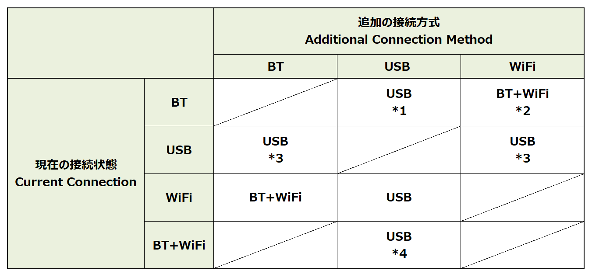
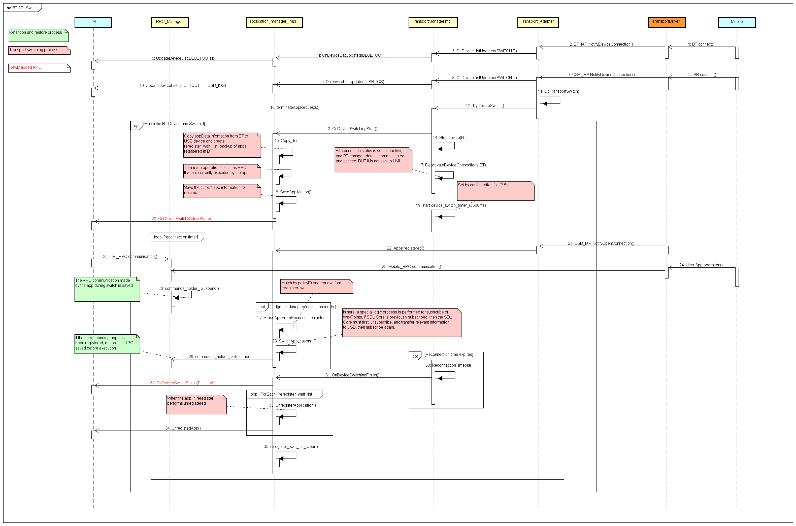

# Clarification of transport switching rules and improvement of UX

* Proposal: [SDL-NNNN](NNNN-Clarification-of-transport-switching-rules-and-improvement-of-UX.md)
* Author: [Akihiro Miyazaki (Nexty)](https://github.com/Akihiro-Miyazaki)
* Status: **Awaiting review**
* Impacted Platforms: [ Core / HMI ]

## Introduction
This proposal is to improve transport switching on the same device.


## Motivation
The rules for transport switching, such as connection priority, when the same device is connected to the Head Unit (HU) with multiple transport methods are not explicitly defined in the current SDL specifications. Therefore, designing the HU transport switching process takes time, thus inefficient.
Additionally, the user cannot know that the connection is being switched because the switching status is not notified to HMI during transport switching. Also, the user cannot operate the app screen on the HU. As a result, it causes an extremely inconvenient state for the user.


## Proposed solution
The following items are proposed to improve the problems mentioned above.
1. Clarification of transport switching rules
2. Addition of transport switching notification to HMI

#### 1. Clarification of transport switching rules
The following transport switching rules and tables should be added to [the SDLC Guidelines](https://smartdevicelink.com/en/guides/core/developer-documentation/transport-manager/) as a specification for multiple transport methods for the same device.

- The priority of transport methods: USD > Bluetooth (BT)<br>Note that WiFi cannot communicate alone by itself, therefore WiFi is excepted from the priority.
- If the SDL connects multiple terminals (mobiles), then the device that is already connected to the SDL is prioritized.

<b>Table 1.</b> Switching of Multiple Transport



*1 : If the HU recognize that current BT and new USB are connected to the same device, SDL transport will switch to USB.<br>
*2 : The SDL app that uses VPM detects WiFi transport when it is launched. If the WiFi transport, which is connected to same device as the BT connection, is found, the SDL App will start VPM via WiFi.<br>
*3 : The USB connection is prioritized, even if both transports are connected to the same device.<br>
*4 : If the HU recognized that current BT and new USB are connected to same device, SDL transport will switch to USB.

#### 2. Addition of transport switching notification to HMI
The following RPC, which will notify the HMI that the transport switching process is in progress, is added.
OEMs can implement processes related to transport switching, such as message display and screen transition, according to the HMI specifications. They can also eliminate the inconvenience for the users when using the transport switch.

New RPC: `OnDeviceSwitchStatus`(HMI_API.xml)

```xml
<function name="OnDeviceSwitchStatus" messagetype="notification">
    <description> Notify HMI of the current state of the Transport  switch </description>
    <param name="status" type="Common.SwitchStatus" mandatory="true"/>
</function>

<enum name="SwitchStatus">
   <element name="Started"/>
   <element name="Finished"/>
</enum>
```

The below shows the new RPC (in red text) is added to the existing logic. It is necessary to add the related information regarding the new RPC, including this sequence diagram, to the "SDL Core Guide" and "HMI Documentation" on SDL Developer Portal (smartdevicelink.com).

*1 The switching from BT to USB logic in the same device transport of iOS is already approved and adopted by SDLC ([PR](https://github.com/smartdevicelink/sdl_evolution/issues/158) and [sequence](https://cloud.githubusercontent.com/assets/11158516/26067529/3f428434-39a3-11e7-910b-6cc4069e0be3.png)).<br>
*2 With the current SDL standard specification, the device cannot be identified whether it is the same device or not. Therefore, device identification by the HU must be a prerequisite.

<b>Figure 1.</b> Sequence with new RPC added to existing logic




## Potential downsides
There are no downsides to this proposal.


## Impact on existing code
This proposal impacts the following:

- SDL Core
- SDL Core Document
- HMI
- HMI Document


## Alternatives considered
No alternatives were considered.

