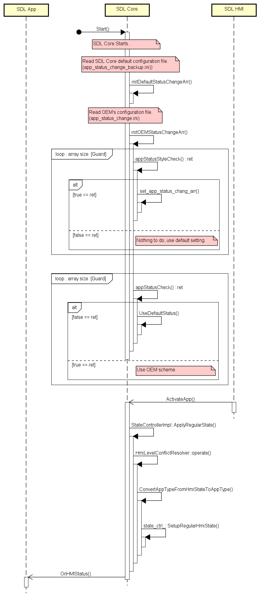

# Function to control the priority of audio and video when switching between apps

* Proposal: [SDL-NNNN](NNNN-Function-to-control-the-priority-of-audio-and-video-when-switching-between-apps.md)
* Author: [Akihiro Miyazaki (Nexty)](https://github.com/Akihiro-Miyazaki)
* Status: **Awaiting review**
* Impacted Platforms: [ Core ]

## Introduction

The aim of this proposal is to add a function to SDL Core. The function allows OEMs to customize the status transition of audio and video when apps are switched. OEMs can control the status transition of apps when those are switched using a customized app status transition rule that is in an additional configuration file.

## Motivation

Switching apps is common SDL behavior. However, the app status transition rule is defined by SDL Core, and OEMs cannot customize the priority of audio and video when switching apps. Therefore, in some cases, it is difficult for OEMs to meet the specifications that they want to implement. For this reason, we propose to add a function in which OEMs can set the priority control of audio and video according to the rules of status transition.

## Proposed solution

We propose adding a new configuration file to SDL Core for defining an OEM's customized rule for status transition for audio and video. Also we propose a management rule of the new configuration file. OEMs can meet the specifications they want to implement by customizing and maintaining the configuration file.

Setting rules of configuration files are below.

- When the SDL app is launched, SDL Core loads two configuration files, the default configuration and the customized one by the OEM. Then, SDL Core selects one of the status transition rules with each situation.
- When the user switches from one app to another app, each status is changed to the appropriate other status by referencing those `appType`s and the status transition table.
- If the OEM's configuration file meets the status transition specification of the SDL Core, SDL Core uses the values in OEM's configuration file.
- If the OEM's configuration file does NOT meet the status transition specification of the SDL Core, SDL Core uses the values in the default configuration file.

The structure of status transition table is below. Table 1 shows the information in the configuration file used to decide the transition status of audio and video when the apps are switched.

<b>Table 1.</b> Information of Status Transition Table

| Field | Description | Value |
| :-- | :-- | :-- |
| App1 | First launched app | MEDIA; NAVIGATION; PROJECTION(isMedia = True); PROJECTION(isMedia = False); OTHER; |
| App2 | Second launched app | MEDIA; NAVIGATION; PROJECTION(isMedia = True); PROJECTION(isMedia = False); OTHER; |
| App1 HMI_LEVEL | HMI Status of App1 after App2 is launched | BACKGROUND=0; FULL=1; LIMITED=2; NONE=3; |
| App1 AUDIBLE | AUDIBLE Status of App1 after App2 is launched | NOT_AUDIBLE=0; AUDIBLE=1; |
| App1 STREAMABLE | STREAMABLE Status of App1 after App2 is launched | NOT_STREAMABLE=0; STREAMABLE=1; |
| App2 HMI_LEVEL | HMI Status of App2 after it is launched | BACKGROUND=0; FULL=1; LIMITED=2; NONE=3; |
| App2 AUDIBLE | AUDIBLE Status of App2 it is launched | NOT_AUDIBLE=0; AUDIBLE=1; |
| App2 STREAMABLE | STREAMABLE Status of App2 it is launched | NOT_STREAMABLE=0; STREAMABLE=1; |

Note:
There are a total of 25 patterns of app combinations (App1 with 5 types x App2 with 5 types) by type.

The SDL specifications for the status transition are below. If OEMs define customized status transition rule, it is necessary to follow the rules below.

- Only one app can be FULL at a time.
- Only one app can be STREAMABLE at a time.
- In case two apps are same `AppType`, only one app can be AUDIBLE.

Setting samples are below.

<b>Table 2.</b> Example 1

| Field | Value |
| :-- | :-: |
| App1 | NAVIGATION |
| App2 | MEDIA |
| App1 HMI_LEVEL | 0 (BACKGROUND) |
| App1 AUDIBLE | 0 (NOT_AUDIBLE) |
| App1 STREAMABLE | 0 (NOT_STREAMABLE) |
| App2 HMI_LEVEL | 1 (FULL) |
| App2 AUDIBLE | 1 (AUDIBLE) |
| App2 STREAMABLE | 1 (STREAMABLE) |

In this case, the status of App1 becomes BACKGROUND, NOT_AUDIBLE and NOT_STREAMABLE after App2 is launched.
At the same time, the status of App2 becomes FULL, AUDIBLE and STREAMABLE.
Head unit (HU) screen display switched to App2 and audio is played from App2.

<b>Table 3.</b> Example 2

| Field | Value |
| :-- | :-: |
| App1 | PROJECTION (isMedia = False) |
| App2 | MEDIA |
| App1 HMI_LEVEL | 2 (LIMITED) |
| App1 AUDIBLE | 0 (NOT_AUDIBLE) |
| App1 STREAMABLE | 1 (STREAMABLE) |
| App2 HMI_LEVEL | 1 (FULL) |
| App2 AUDIBLE | 1 (AUDIBLE) |
| App2 STREAMABLE | 0 (NOT_STREAMABLE) |

In this case, the status of App1 becomes LIMITED, NOT_AUDIBLE after App2 is launched, but STREAMABLE status is kept as STREAMABLE.
At the same time, the status of App2 becomes FULL, AUDIBLE and NOT_STREAMABLE.
HU screen display switched to App2 and basic audio is ready to be played from App2. App1 is not displayed on the screen, but playback of the video continues in background.

#### Error processing

When the SDL app is launched, SDL Core loads two configuration files, the default configuration and the customized one by the OEM. Basically, SDL Core uses the OEM's configuration file, but if it does not meet the status transition specification of the SDL Core implementation, SDL Core discards the OEM's configuration file and uses the setting in the default configuration file. Table 4 is example of the invalid errors in the OEM's customized status transition (in this transition rule, 2 apps can be set with STREAMABLE status at the same time). In this case, SDL Core discards only the non-conforming part of the setting provided by the OEM's configuration file and uses the value of the default one.

<b>Table 4.</b> OEM's specification of Status Transition (the case of error)

| Field | Value |
| :-- | :-: |
| App1 | NAVIGATION |
| App2 | MEDIA |
| App1 HMI_LEVEL | 2 (LIMITED) |
| App1 AUDIBLE | 1 (AUDIBLE) |
| App1 STREAMABLE | 1 (STREAMABLE) |
| App2 HMI_LEVEL | 1 (FULL) |
| App2 AUDIBLE | 1 (AUDIBLE) |
| App2 STREAMABLE | 1 (STREAMABLE) |

<b>Table 5.</b> Default Status Transition value of default configuration file

| Field | Value |
| :-- | :-: |
| App1 | NAVIGATION |
| App2 | MEDIA |
| App1 HMI_LEVEL | 2 (LIMITED) |
| App1 AUDIBLE | 1 (AUDIBLE) |
| App1 STREAMABLE | 1 (STREAMABLE) |
| App2 HMI_LEVEL | 1 (FULL) |
| App2 AUDIBLE | 1 (AUDIBLE) |
| App2 STREAMABLE | 0 (NOT_STREAMABLE) |

Figure 1 shows the switching sequence of apps controlled by the status transition. The following rules are described in this sequence.

1. When the SDL app is launched, SDL Core loads default values of status transition from the default configuration file.
2. SDL Core loads the configuration file customized by the OEM, and initializes the status transition table by following the rule.
3. When the user switches from one app to another app, the apps' behaviors after switching are applied by the status transition table.

<b>Figure 1.</b> Switching apps sequence

## Potential downsides

None.

## Impact on existing code

- These changes affect only the status transition of SDL Core when apps are switched.

## Alternatives considered

None.
