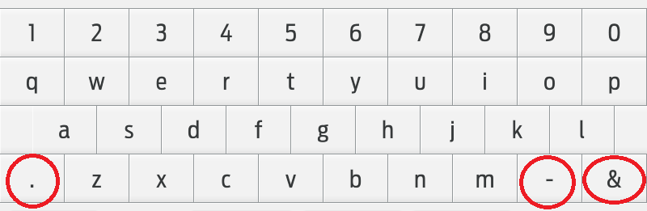
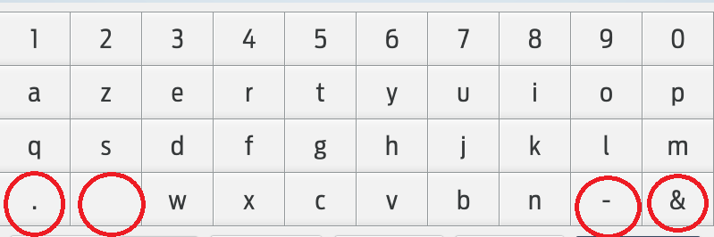
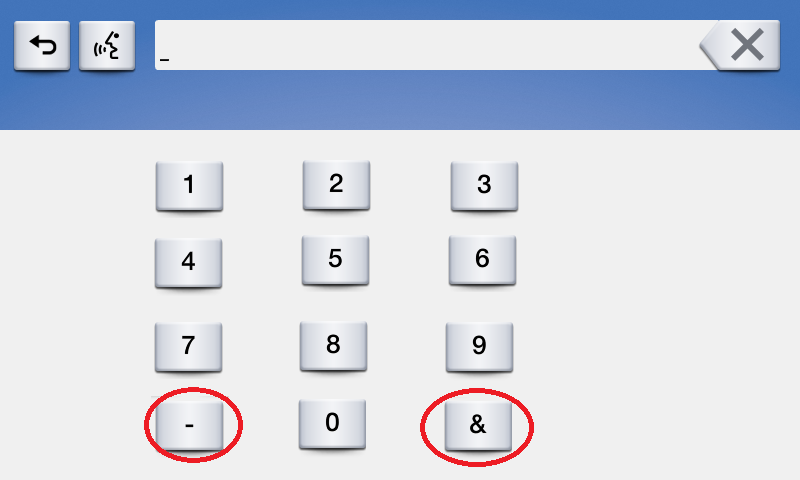

# Keyboard Enhancements

* Proposal: [SDL-NNNN](NNNN-Keyboard-Enhancements.md)
* Author: [Ashwin Karemore](https://github.com/ashwink11)
* Status: **Awaiting review**
* Impacted Platforms: [ Android / iOS / RPC / Core]

## Introduction

This proposal is about adding a new keyboard layout and adding new properties for keyboards supported by SDL. The following keyboard enhancements are discussed in this proposal.

**_Enhancement #1: Support for Numeric Keyboard._**

**_Enhancement #2: Allow apps to mask entered characters._**

**_Enhancement #3: Allow apps to change special characters shown on the keyboard layout._**

## Motivation

Depending on app use cases, the app would need users' input. These inputs might require users to enter numeric values or special characters.

>Example: Some of the SDL enabled apps use PIN authentication method. Currently, these apps cannot use existing keyboard layouts provided by HMI because of the following reasons.
>1. Apps cannot show the desired keypad on HMI for e.g in case of PIN authentication, apps need a numeric keypad
>2. Entered characters are not hidden on the IVI keyboard screen. Apps would like to specify if the input should be shown or masked.


Due to above mentioned issues, app users need to use a mobile device for authentication, causing aberration in basic flow of use cases. 

In addition to the above issues, some apps expect input with special characters. However, providing all special characters at the root level of the keyboard is impossible. 

>Example: Certain Apps expect punctuation mark in users' input. Unfortunately, punctuation mark is not shown at root level in some of the keyboard layouts. Users need to go to the symbols screen or sub-level of keyboards to use punctuation mark. 
>
>Another example would be an app using a numeric keypad for payments. If we consider this use case of entering amount for payment, the app would expect a decimal separator on a numeric keyboard. Now, since different countries use a different decimal separator, users would expect decimal separator used for their country to be shown at the root level of keyboard layout. 


In both of the above examples, if a special character; which an app expects, is not shown at the root level of a keyboard,the user needs to find it in symbols' page or sub-levels of a keyboard.

It would be convenient for users and desirable for app partners, if an app can configure special characters, accepted as input value in text fields, at the root level of Keyboard. 

This proposal addresses above mentioned issues.

**_Please refer below sample keyboard layouts.As you can see there's always a possibility to customize special characters button marked by red circle_**

_As shown in the sample Layouts, for QWERTY, there could be three customizable buttons for the special characters, for AZERTY, there could be four and for numeric keyboard, there could be two customizable buttons._

**_Number of customizable buttons could be different for different Layouts._**







## Proposed solution

1. SDL needs to define new struct _"KeyboardCapabilities"_ to inform apps about keyboard capabilities of HMI.
2. _"KeyboardCapabilities"_ struct should be returned with _"RegisterAppInterface"_ response.
3. This struct should inform the apps about all the supported keyboard layouts, the capability to mask input characters and to configure special character keys in a keyboard layout.

**_Addition for Enhancement #1: Adding support for numeric keyboard._**

1. Add _"NUMERIC"_ value in _"KeyboardLayout"_ enum. This enum value should allow apps to use numeric keypad.
2. If HMI supports numeric keypad, SDL core should return _"NUMERIC"_, value in _"supportedKeyboardLayouts"_ in _"KeyboardCapabilities"_ struct.

**_Addition for Enhancement #2: Allow apps to mask entered characters._**

1. Add _"maskInputCharacters"_ element in _"KeyboardProperties"_ struct. This element _"maskInputCharacters"_ will let HMI keyboard know, if it should start masking input characters. 
2. _"maskInputCharacters"_ will take values of type _"KeyboardInputMask"_ enum.
3. If _"maskInputCharacters"_ is set as _"ENABLE_INPUT_KEY_MASK"_, keyboard will mask input characters and if _"maskInputCharacters"_ is set as _"DISABLE_INPUT_KEY_MASK"_, keyboard will show input characters. 
4. *By default, value of "maskInputCharacters" will be "DISABLE_INPUT_KEY_MASK".*
5. SDL core should return _"maskInputCharactersSupported"_ equals true in _"KeyboardCapabilities"_ struct, if HMI supports masking input characters in the keyboard layout.

**_Addition for Enhancement #3: Allow apps to change special characters shown on the Keyboard Layout._**

1. SDL should define new Struct _"ConfigurableKeyboards"_. This struct should provide info about the number of special character keys, which can be configured in Keyboard Layout.
2. If HMI supports this keyboard capability, the SDL core should return an array of _"configurableKeys"_ param in _"KeyboardCapabilities"_ Struct. 

**_This enhancement is applicable only for root level keys in the keyboard layout. If HMI does not provide configurable keys in root level of keyboards, the system should return Zero in number of configurable keys._**

**For example:** If an app wants to use _"QWERTY"_ Keyboard Layout, but HMI does not support Configurable keys at the root level. it should return _"ConfigurableKeyboards"_ Struct with _"keyboardLayout"_ equals _"QWERTY"_ (defined in _"KeyboardLayout"_) and _"numOfKeys"_ equals _Zero_.

### MOBILE_API and HMI_API Changes

#### Addition of _"KeyboardCapabilities"_ struct
 
_"KeyboardCapabilities"_ should be a struct defined as below. 

In case of older SDL versions, if _"maskInputCharactersSupported"_ value is not available, App should consider that this capability is not available.
 
```xml
<struct name="KeyboardCapabilities" since="X.X">
       <param name="maskInputCharactersSupported" type="Boolean" mandatory="false">
           <description>Availability of capability to mask input characters using keyboard. True: Available, False: Not Available</description>
       </param>
	   <param name="supportedKeyboardLayouts" type="KeyboardLayout" minsize="0" maxsize="10" array="true" mandatory="false" since="X.X" >
           <description>Supported keyboard layouts by HMI.</description>
       </param> 
	   <param name="configurableKeys" type="ConfigurableKeyboards" minsize="0" maxsize="10" maxlength="10" array="true" mandatory="false" since="X.X" >
           <description>Get Number of Keys for Special characters, App can customize as per their needs.</description>
       </param>  
</struct>
```

#### Addition of _"KeyboardInputMask"_ enum

1. App should set _"maskInputCharacters"_ in _"KeyboardProperties"_ using below defined _"KeyboardInputMask"_ values.
2. _"ENABLE_INPUT_KEY_MASK"_ - HMI should mask input characters entered using Keyboard.
3. _"DISABLE_INPUT_KEY_MASK"_ - HMI should not mask input characters entered using Keyboard.
4. _"USER_CHOICE_INPUT_KEY_MASK"_ - HMI should mask entered characters, however, HMI should allow Users to change this and see input characters. HMI would provide a key to unmask characters. 
5. The app will be notified using _"KeyboardEvent"_ in _"OnKeyboardInput"_ notification, whether input values will be masked or not. This notification will be sent to make the app aware that the intended effect of keyboard properties are applied. Changes in  _"KeyboardEvent"_ struct are discussed in the next section.

```xml
    <enum name="KeyboardInputMask" since="X.X">
        <description>Enumeration listing possible input character masking.</description>
        <element name="ENABLE_INPUT_KEY_MASK" />
        <element name="DISABLE_INPUT_KEY_MASK" />
        <element name="USER_CHOICE_INPUT_KEY_MASK" />
    </enum>    
```

#### Changes in _"KeyboardEvent"_ Enum

If App sends _"maskInputCharacters"_ value as _"USER_CHOICE_INPUT_KEY_MASK"_, the HMI keyboard will provide a key, so that the user can unmask input characters.
The app will be notified whether the input is masked or not, using _"UI.OnKeyboardInput"_ with below keyboard events.

```xml
<enum name="KeyboardEvent">
	:
	<element name="INPUT_KEY_MASK_ENABLED"/>
	<element name="INPUT_KEY_MASK_DISABLED"/>
</enum>
```

#### Addition of _"ConfigurableKeyboards"_ Struct

This struct object will be returned with _"KeyboardCapabilities"_ in _"RegisterAppInterface"_ response. Each layout can have a different number of customizable buttons. Hence, this struct object will map a number of customizable buttons and keyboard layout.

```xml
    <struct name="ConfigurableKeyboards" since="X.X">
        <description>
            Describes number of cofigurable Keys for Special characters.
        </description>
        <param name="keyboardLayout" type="KeyboardLayout" mandatory="true"/>
        <param name="numOfKeys" type="Integer" mandatory="true"/>
    </struct>
```


#### Change in _"KeyboardLayout"_ enum

```xml
<enum name="KeyboardLayout">
	:
	<element name="NUMERIC"/>
</enum>
```

#### Change in _"KeyboardProperties"_ struct

1. App can request masking input characters using _"maskInputCharacters"_ param in _"KeyboardProperties"_ struct.
2. App can request changes in special characters shown in the keyboard layout using _"customizeKeys"_ array. To set these buttons, app can just send an array of _"Strings"_ with special characters in _"customizeKeys"_ in _"SetGlobalProperties"_ RPC.
3. If App does not send this string, HMI should show default special characters in the keyboard layout.
4. If the number of keys in _"customizeKeys"_ array is more than customizable keys allowed, the SDL core should respond with _"INVALID_DATA"_ and the info string should include a detailed message, that **_"customizeKeys exceeds the number of customizable keys in this Layout"_**.
5. If the number of keys in _"customizeKeys"_ array is less than or equal to customizable keys allowed, the SDL core should respond with _"SUCCESS"_. 
6. HMI should show default characters in the remaining customizable Keys. if _"customizeKeys"_ array is less than or equal to the customizable keys allowed.
7. If a certain special character is not supported by the system. The HMI should send _"WARNING"_ response, with _"info"_ text as _" some symbols might not be supported by system"_. This will give a chance to use symbols that are supported and also inform the app about the system not supporting certain characters.

**Example usage:** If an app wants to change three symbols, the app sends the value of _"customizeKeys"_ as _"₹£$"_. The parameter follows a similar structure as _"limitedCharacterList"_.
 
 ```xml
     <struct name="KeyboardProperties" since="3.0">
        <description>Configuration of on-screen keyboard (if available).</description>         
		:       
		<param name="maskInputCharacters" type="KeyboardInputMask" mandatory="false"  since="X.X"> 
			<description>Allows an app to mask entered chanracters on HMI</description>
		</param> 
		<param name="customizeKeys" type="String" maxlength="1" minsize="1" maxsize="10" array="true" mandatory="false"  since="X.X">
            <description>Array of special characters to show in customisable Keys.</description>
            <description>If omitted, keyboard will show default special characters</description>
        </param>  
    </struct>
 ```

#### Change in _"RegisterAppInterface"_ response
 
```xml
<function name="RegisterAppInterface" functionID="RegisterAppInterfaceID" messagetype="response" since="1.0">
		:
        <param name="keyboardCapabilities"  type="KeyboardCapabilities" mandatory="false" since="X.X">
            <description>See KeyboardCapabilities</description>
        </param>
</function>
```

## Alternatives considered 

Instead of returning _"KeyboardCapabilities"_ in _"RegisterAppInterface"_, struct _"ScreenCapability"_ can be used. [Struct _"ScreenCapability"_ is defined in Widget Support Proposal.](https://github.com/smartdevicelink/sdl_evolution/blob/master/proposals/0216-widget-support.md)

### Change in ScreenCapability

```xml
<struct name="ScreenCapability" since="5.x">
    :
    <param name="keyboardCapabilities"  type="KeyboardCapabilities" mandatory="false" since="X.X">
        <description>See KeyboardCapabilities</description>
    </param>
</struct>
```

## HMI changes

1. The HMI should add the support for numeric keypad.
2. In cases, where App sets _"maskInputCharacters"_ as _"USER_CHOICE_INPUT_KEY_MASK"_, HMI Keyboard should provide a button to the user to show/hide characters entered using the keyboard. 
3. In cases, where app sets _"maskInputCharacters"_ as _"ENABLE_INPUT_KEY_MASK"_ or _"DISABLE_INPUT_KEY_MASK"_, HMI keyboard will not provide a button to the user to show/hide characters entered using the keyboard. 

## Android and iOS changes

The libraries need to implement mobile API changes.
