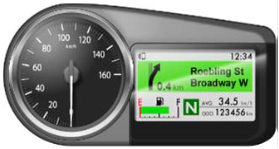
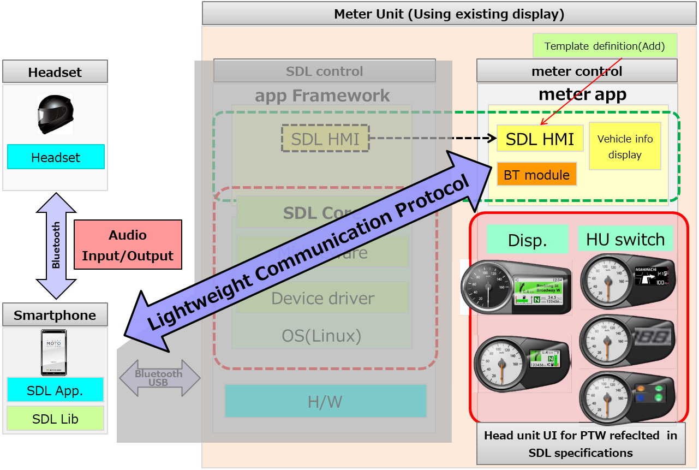
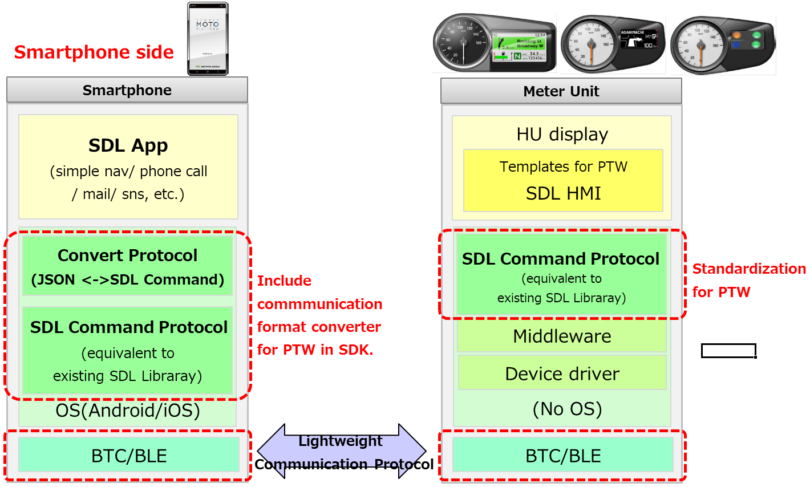

# SDL System Structure for Middle/Low-end Class Model of Powered Two Wheeler

* Proposal: [SDL-NNNN](NNNN-SDL-System-Structure-for-MiddleLow-end-Class-Model-of-Powered-Two-Wheeler.md)
* Author: [Akihiro Miyazaki (Nexty)](https://github.com/Akihiro-Miyazaki)
* Status: **Awaiting review**
* Impacted Platforms: [ Core / iOS / Java Suite / Javascript Suite / HMI / Policy Server / RPC / Protocol ]

## Introduction

This proposal is to construct a lightweight/simple display SDL system for Powered Two Wheeler (PTW) *1 middle/low-end class models.

*1 Powered Two Wheeler (PTW) includes motorcycles/scooter/moped.

<b>Figure1.</b> Sample of a simple meter display

## Motivation

The current SDL system is mainly for four-wheeled vehicles and requires a high-performance/high-resolution system. (The binary size is 177MB when built with x86_64.) However, it is not possible to mount a high-performance/high-resolution system on a PTW due to the limitation of space and price that it has. Therefore, support for PTW in the current SDL system is not incorporated. The main purpose of this proposal is to construct a simple and lightweight SDL system for PTW middle/low-end class models.

## Proposed solution

Currently, PTW can be classified into the following classes by their meter display specifications.
 - High-end class: display specifications and ECU performance are equivalent to that of a four-wheeled vehicle.
 - Middle-end class: a TFT liquid-crystal display but has restrictions such as the area assigned to the SDL is small, and ECU performance is low.
 - Low-end class: simple display specifications and low ECU performance.

The implementation of high-end class can be realized, first, by adding the PTW's specification (divided screen diplay of meter and SDL app, PTW information, etc) to the current SDL specification. Therefore, as of now, it is out of the scope of this proposal. A separate proposal will be created when needed.

The middle/low-end class can only do a simple display, so functions such as Projection are unnecessary. Additionally, since many ECUs do not have an OS, components that depend on the OS are unnecessary as well. By removing such unnecessary functions, the SDL system for lightweight/simple display can be constructed. Then, the current SDL communication format in JSON will be converted to binary format to reduce data such as character strings.

<b>Figure2.</b> SDL System for Middle/Low end class

As figure 3, the actual proxy and definition of system structure on the meter side are included SDL SDK in Smartphone.

<b>Figure3.</b> System structure of proxy and meter unit

Regarding the SDL Proxy, a lightweight communication can be performed by incorporating a communication converter module for middle/low-end class. The exchange of information during the initial communication between SDL Core and Proxy will distinguish whether it is for middle/low-end class or not and then develops SDL Apps with the same SDL Proxy.

Note that this proposal is only a policy proposal. We will provide a separate proposal for function according to the use case of PTW after this proposal is approved.

## Impact on existing code

This proposal is to create a new implementation of the SDL Specification, thus includes major changes, but it will not affect the existing codes.
The target of this proposal are the following platforms:
- iOS
- Java Suite
- Javascript Suite
- PolicyTable
- SDL Core
- HMI
- Protocol
- RPC

## Potential downsides

Due to changes, there may be a huge diffenrence with the existing SDL. If the SDL Core specification becomes compatible with both PTW and four-wheeled vehicles, at this point, we assume that we can create an SDL Core for PTW (or four-wheeled vehicles) by selecting this option during the core build. However, this might lead to a high possibility of complexity in the software structure. In some cases, it will be necessary to branch, but in that case it will be necessary to maintain each.

## Alternatives considered

One alternative considered is to improve the ECU/display function of middle/low-end class, so that the existing SDL system can be used. However, it impossible because it requires additional hardware such as increased memory and changes in display specifications, and the cost cannot be met. For this reason, there is no effective alternative.
