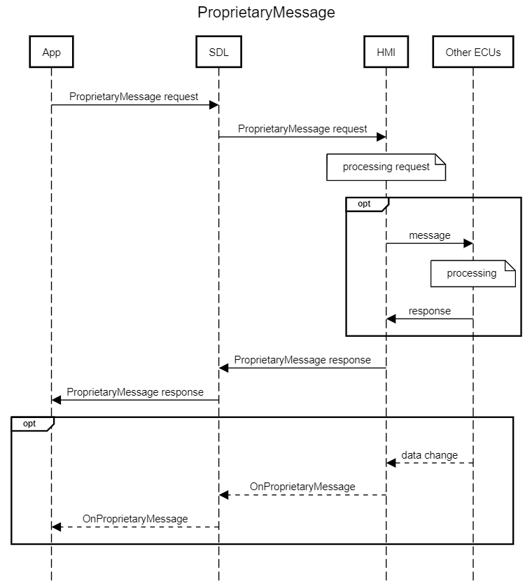
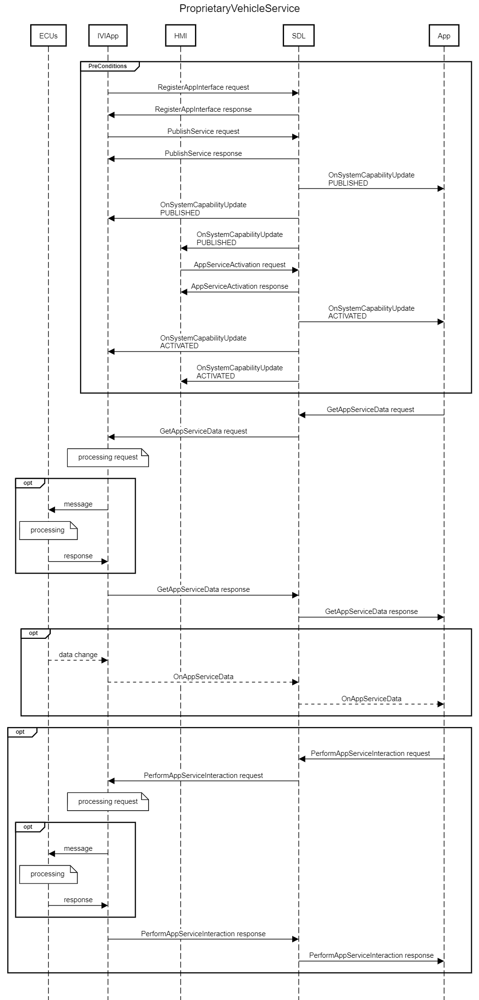

# Extend SystemRequest With Optional Data For Proprietary Data Exchange

* Proposal: [NNNN](NNNN-System-Request.md)
* Author: [Zhimin Yang](https://github.com/smartdevicelink/yang1070)
* Status: **Awaiting review**
* Impacted Platforms: [Core / iOS / Java Suite / RPC]

## Introduction

RPC `SystemRequest` and `OnSystemRequest` can send bulk binary data between a mobile app and the system using hybrid messasge. However, the communication between SDL core and HMI relies on file system operations, which are slow.

## Motivation

With the growing popularity of SDL, more components within the head unit would like to exchange their data in a component specific proprietary way with the owner applications. Currently a file needs to be passed between SDL and HMI to exchange the data. File operaions (create, read, write, delete) are slow. It is better to send data ( especailly a small amount of data) using message directly.

## Proposed solution

Adding a new optional parameter to the existing `SystemRequest` request/response and `OnSystemRequest` notifications.


mobile api

```xml
<function name="SystemRequest" functionID="SystemRequestID" messagetype="request" since="3.0">
    :
    :
+   <param name="requestData" type="String" maxlength="65535" mandatory="false" since="x.x">
+       <description>
+           Data send from mobile app to the system. If it exists, "fileName" shall be ignored; No binary data included.
+       </description>
+   </param>
</function>

<function name="SystemRequest" functionID="SystemRequestID" messagetype="response" since="3.0">
    :
    :
+   <param name="resultData" type="String" maxlength="65535" mandatory="false" since="x.x">
+       <description> Result data from the system to the mobile app. </description>
+   </param>
</function>

<function name="OnSystemRequest" functionID="OnSystemRequestID" messagetype="notification" since="3.0">
    :
    :
+   <param name="data" type="String" maxlength="65535" mandatory="false" since="x.x">
+       <description> Data from the system to the mobile app. If it exists, "fileName" shall be ignored; No binary data included </description>
+   </param>
</function>
```

HMI API

```xml
<function name="OnSystemRequest" messagetype="notification" >
    :
    :
+   <param name="data" type="String" maxlength="65535" mandatory="false">
+       <description> Data from the system to the mobile app. If it exists, "fileName" shall be ignored; No binary data included </description>
+   </param>
</function>

<function name="SystemRequest" messagetype="request">
    :
    :
+   <param name="requestData" type="String" maxlength="65535" mandatory="false">
+       <description>
+           Data send from mobile app to the system. If it exists, "fileName" shall be ignored; No binary data included.
+       </description>
+   </param>
</function>

<function name="SystemRequest" messagetype="response">
+   <param name="resultData" type="String" maxlength="65535" mandatory="false">
+       <description> Result data from the system to the mobile app. </description>
+   </param>
</function>
```

To send and receive small amount of binary data, "requestData", "data", "resultData" shall be base64 encoded.

To send and receive json data, "requestData", "data", "resultData" shall be properly escaped (stringified).

## Potential downsides

N/A

## Impact on existing code

- MOBILE_API and HMI_API need to be updated.
- SDL core and proxy lib need to be updated.


## Alternatives considered


###  Alternative 1
Creata a new set of RPCs (`ProprietaryMessage` and `OnProprietaryMessage`) for passing the data through.



Mobile API.

```xml
<struct name="ProprietaryVehicleData">
    <description> expandable vehicle data </description>
    <!--
        <param name="data1" type="Type1" mandatory="false">
        <param name="data2" type="Type2" mandatory="false">
        <param name="data3" type="Type3" mandatory="false">
        <param name="data4" type="Type4" mandatory="false">
    -->
</struct>

<struct name="GenericData">
    <param name="rawData" type="Integer" minsize="1" maxsize="65535" array="true" mandatory="false">
        <description> raw data array </description>
    </param>
    <param name="base64Data" type="String" minsize="4" maxsize="65535" mandatory="false">
        <description> base64 encoded binary data </description>
    </param>
    <param name="escapedData" type="String" minsize="1" maxsize="65535" mandatory="false">
        <description> JSON escaped string data </description>
    </param>
    <param name="vData" type="ProprietaryVehicleData" mandatory="false">
        <description> expandable vehicle data </description>
    </param>
</struct>
```
```xml
<function name="ProprietaryMessage" functionID="ProprietaryMessageID" messagetype="request" since="x.x">
    <description> private message request </description>

    <param name="type" type="String" maxlength="255" mandatory="false">
        <description> string value must comes from a private feature list </description>
    </param>

    <param name="subType" type="String" maxlength="255" mandatory="false">
        <description> string value must comes from a private function list </description>
    </param>

    <param name="data" type="GenericData" mandatory="false">
        <description> private message data. </description>
    </param>
</function>
```
```xml
<function name="ProprietaryMessage" functionID="ProprietaryMessageID" messagetype="response" since="x.x">
    <param name="success" type="Boolean" platform="documentation" mandatory="true">
        <description> true, if successful; false, if failed </description>
    </param>

    <param name="resultCode" type="Result" platform="documentation" mandatory="true">
        <description>See Result</description>
        <element name="SUCCESS"/>
        <element name="INVALID_DATA"/>
        <element name="OUT_OF_MEMORY"/>
        <element name="TOO_MANY_PENDING_REQUESTS"/>
        <element name="APPLICATION_NOT_REGISTERED"/>
        <element name="GENERIC_ERROR"/>
        <element name="REJECTED"/>
        <element name="INVALID_CERT"/>
        <element name="EXPIRED_CERT"/>
        <element name="UNSUPPORTED_REQUEST"/>
        <element name="UNSUPPORTED_RESOURCE"/>
        <element name="DISALLOWED"/>
        <element name="ABORTED"/>
        <element name="WARNINGS"/>
        <element name="TIMED_OUT"/>
        <element name="IGNORED"/>
    </param>

    <param name="info" type="String" maxlength="1000" mandatory="false" platform="documentation">
         <description>Provides additional human readable info regarding the result.</description>
    </param>

    <param name="resultData" type="GenericData" mandatory="false" >
        <description> result data from the system to the mobile app. </description>
    </param>
</function>
```
```xml
<function name="OnProprietaryMessage" functionID="OnProprietaryMessageID" messagetype="notification" since="x.x">
    <description>
        An asynchronous notification from the system for specific data
    </description>

    <param name="type" type="String" maxlength="255" mandatory="false">
        <description> string value must comes from a private feature list </description>
    </param>

    <param name="subType" type="String" maxlength="255" mandatory="false">
        <description> string value must comes from a private function list </description>
    </param>

    <param name="data" type="GenericData" mandatory="false">
        <description> private message data. </description>
    </param>
</function>
```

HMI API.

```xml
<struct name="ProprietaryVehicleData">
    <description> expandable vehicle data </description>
    <!--
        <param name="data1" type="Type1" mandatory="false">
        <param name="data2" type="Type2" mandatory="false">
        <param name="data3" type="Type3" mandatory="false">
        <param name="data4" type="Type4" mandatory="false">
    -->
</struct>

<struct name="GenericData">
    <param name="rawData" type="Integer" minsize="1" maxsize="65535" array="true" mandatory="false">
        <description> raw data array </description>
    </param>
    <param name="base64Data" type="String" minsize="4" maxsize="65535" mandatory="false">
        <description> base64 encoded binary data </description>
    </param>
    <param name="escapedData" type="String" minsize="1" maxsize="65535" mandatory="false">
        <description> JSON escaped string data </description>
    </param>
    <param name="vData" type="ProprietaryVehicleData" mandatory="false">
        <description> expandable vehicle data </description>
    </param>
</struct>


```
```xml
<function name="ProprietaryMessage" messagetype="request">
    <description> private message request</description>

    <param name="type" type="String" maxlength="255" mandatory="false">
        <description> string value must comes from a private feature list </description>
    </param>

    <param name="subType" type="String" maxlength="255" mandatory="false">
        <description> string value must comes from a private function list </description>
    </param>

    <param name="data" type="GenericData" mandatory="false">
        <description> private message data. </description>
    </param>

    <param name="appID" type="Integer" mandatory="true">
        <description>Internal ID of the application that requested this RPC.</description>
    </param>
</function>
```
```xml
<function name="ProprietaryMessage" messagetype="response" >
    <description> private message response </description>
    <param name="resultData" type="GenericData" mandatory="false" >
        <description> Result data from the system to the mobile app. </description>
    </param>
</function>
```
```xml
<function name="OnProprietaryMessage" messagetype="notification">
    <description>
        An asynchronous notification from the system for specific data
    </description>

    <param name="type" type="String" maxlength="255" mandatory="false">
        <description> string value must comes from a private feature list </description>
    </param>

    <param name="subType" type="String" maxlength="255" mandatory="false">
        <description> string value must comes from a private function list </description>
    </param>

    <param name="data" type="GenericData" mandatory="false">
        <description> private message data. </description>
    </param>

    <param name="appID" type="Integer" mandatory="true">
        <description>Internal ID of the application that requested this RPC.</description>
    </param>
</function>
```
###  Alternative 2
Creata a new app service `ProprietaryVehicleData` (or `PVD` for short) Service and re-use the app services framework.  Make sure that only OEM can publish such service.



mobile API.
```xml
<enum name="AppServiceType" platform="documentation" since="5.1">
    :
    :
+   <element name="PVD" since="5.x"/>
</enum>
```

```xml
<struct name="ProprietaryData" since="x.x">
    <description> expandable vehicle data </description>
    <!--
        <param name="data1" type="Type1" mandatory="false">
        <param name="data2" type="Type2" mandatory="false">
        <param name="data3" type="Type3" mandatory="false">
        <param name="data4" type="Type4" mandatory="false">
    -->
</struct>

<struct name="GenericData" since="x.x">
    <param name="rawData" type="Integer" minsize="1" maxsize="65535" array="true" mandatory="false">
        <description> raw data array </description>
    </param>
    <param name="base64Data" type="String" minsize="4" maxsize="65535" mandatory="false">
        <description> base64 encoded binary data </description>
    </param>
    <param name="escapedData" type="String" minsize="1" maxsize="65535" mandatory="false">
        <description> JSON escaped string data </description>
    </param>
    <param name="vData" type="ProprietaryData" mandatory="false">
        <description> expandable vehicle data </description>
    </param>
</struct>

<struct name="PVDServiceData" since="x.x">
    <param name="type" type="String" maxlength="255" mandatory="false">
        <description> string value must comes from a private feature list </description>
    </param>

    <param name="subType" type="String" maxlength="255" mandatory="false">
        <description> string value must comes from a private function list </description>
    </param>

    <param name="data" type="GenericData" mandatory="false">
        <description> private message data. </description>
    </param>
</function>
```

```xml
<struct name="AppServiceData" since="5.1">
    :
    :
+   <param name="pvdServiceData" type="PVDServiceData" mandatory="false" since="5.x"/>
</struct>

+<struct name="PVDServiceManifest" since="5.x">
+
+</struct>

<struct name="AppServiceManifest" since="5.1">
    :
    :
+   <param name="pvdServiceManifest" type="PVDServiceManifest" mandatory="false"/>
</struct>
```


Similar HMI updates needed.

###  Alternative 3

Currently, only JSON message interface is defined between SDL core and HMI. Binary data cannot be transmit using this interface directly.
In this alternative, no mobile api change is needed. But we need a way to include binary data in the message between SDL core and HMI, so that for small data, no file operation is needed.
