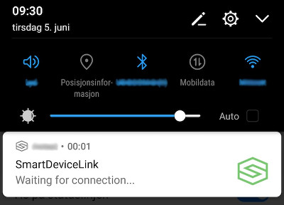

# Android Oreo Foreground Services issue

* Proposal: [SDL-NNNN](NNNN-android-oreo-foreground-services.md)
* Author: [Kujtim Shala](https://github.com/kshala-ford)
* Status: **Awaiting review**
* Impacted Platforms: [ Android ]

## Introduction

This proposal addresses an issue with Android Oreo background requirements forcing SDL for Android become potentially intrusive to all users with or without owning an SDL capable vehicle.

## Motivation

With Android Oreo Google added [Background Service Limitations](https://developer.android.com/about/versions/oreo/background#services) for services running in the background.  Services are used to maintain SDL proxies as well as the router service providing multiplexing. With [SDL Android v4.5.0](https://github.com/smartdevicelink/sdl_android/releases/tag/4.5.0) a fix was added to make the router service visible using a notification shown in the Android notification center. This notification is visible for 10 to 20 seconds (depending on the number of SDL apps installed on the phone).

[SDL Android v4.6.0](https://github.com/smartdevicelink/sdl_android/tree/release/4.6.0_RC) (currently under development) improves the behavior adding flags to known bluetooth devices. This flag will indicate if the app ever connected and registered to the connected Bluetooth device. 

> The new logic will keep the service in the foreground for 10 seconds if it is a device that has never been seen before or rather the first time the device has connected over bluetooth, if the device does NOT connect, the mac address of the device will be stored with a flag indicating it should be ignored. If it DOES connect over SDL, the notification will then be present for 20 seconds on connection to that device to ensure a connection happens in all scenarios. The router service will still be started for devices that have the flag indicating to ignore those devices, but the service is immediately taken out of the foreground state. This is necessary since in Android O+ services have to be started into the foreground when started by background applications.

This behavior is way better compared to v4.5.0 however the SDL related notification will still be visible to pure non-SDL users. We expect the the risk app partners may weigh benefits integrating SDL and complains from non-SDL users potentially giving bad rates or stop using the app.

## Proposed solution

The proposed solution is to change the behavior how apps prepare the SDL connection to Bluetooth devices. The idea is to create the SDL proxy only while the app is in foreground on the phone while it never connected to a head unit. It's not allowed to start the router service from the background if it's not known the BT device will connect to it. Once the app has registered to a head unit it's allowed to start the router service in future if that BT device connnects.

As a result no SDL code will cause any visible elements on the Android phone until the app established a connection to the vehicle.

The first time use will be different as the phone must be unlocked and the SDL app must be in foreground. Any subsequent BT connnection to that device will make the app start the service from the background using the Android notification. It's expected that the user may accept the existance of this notification.

Once the first time use is done for the first SDL apps it's router service may notify other apps of the acceptance of SDL usage. This avoid to redo the guid for each app but only for the first app installed on the phone. 

The "first time" guide may look like the following list:

1. Make sure your vehicle is in standstill when connecting the app to your vehicle
2. Connect your Android phone over Bluetooth to the infotainment system
3. Select the Applications Tab on your infotainment system
4. Start the app "APP_NAME" on your phone
5. If the app is not already listed press "Find Mobile Applications"
6. Next time you enter the vehicle can leave your phone in the pocket. The app will recognize the vehicle and automatically connect.

## Detailed requirements

### 1. No router service with app in background for unknown BT devices

#### Conditions

- An SDL enabled app is not in foreground on the phone
- The app never established to register to the connected Bluetooth device
- On the phone there is no router service provided by another app 

#### Requrement

The app must not start SDL related services.

#### Comments

This is the case if the app is newly installed or updated with SDL support and no other SDL enabled app is installed or have been able to connect.

### 2. Router service with app in foreground for unknown BT devices

#### Conditions

- An SDL enabled app is in foreground on the phone
- The app never established to register to the connected Bluetooth device
- On the phone there is no router service provided by another app 

#### Requirement

1. The app should start the SDL related services as a regular service (not in foreground).

2. The app should keep the services up and running for the time the app is in foreground.

3. The app should stop the services when entering background.

#### Comments

This is required. Otherwise the app will never be prepared for SDL head units.

### 3. App made it to connect to unknown BT device

#### Conditions

- An SDL enabled app is in foreground on the phone
- The app never established to register to the connected Bluetooth device
- On the phone there is no router service provided by another app 
- App got connected and registered to the head unit

#### Requirements

1. The app should store that information
2. The app should make the router service a foreground service

#### Comments

This is the end of the "first time" guide storing the information of the user owning an SDL capable device

### 4. Router service with app in background for known SDL BT devices

#### Conditions

- An SDL enabled app is not in foreground on the phone
- The app established to register to the connected Bluetooth device
- On the phone there is no router service provided by another app 

#### Requirements

1. The app should start the router service as a foreground service including a notification.

2. The router service should stay in foreground while being connected to that BT device (no timeout after 10 - 20 seconds)

#### Comments

As the app knows that the device supports SDL it can start the router service and keep is active/foregrounded

### 5. App connect to router service when in background

#### Conditions

- An SDL enabled app is in foreground on the phone
- The app never established to register to the connected Bluetooth device
- On the phone another app has created the router service

#### Requirements

1. The app's proxy should connect to the router service
 
2. The router service should tell the app if the connected BT device is known to support SDL

#### Comments

This behavior can exist if another SDL enabled app is in foreground. It does not neceesarily know if the BT device supports SDL.

## Potential downsides

The downside is the reduce experience for the first time use as the phone must be unlocked and the app must be started. It's expected that users might do this anyway if the know about the SDL support.

## Impact on existing code

Changes to the library are not identified but it's expected that this change will be possible in a minor version change. 

## Alternatives considered

Not really an alternative but an addition to the proposal is to make this guide optional for apps. This means apps that are supposed to be used mainly in the vehicle (e.g. FordPass) should not implement these requirements. It's expected that users install these apps with the purpose of in-vehicle use.
