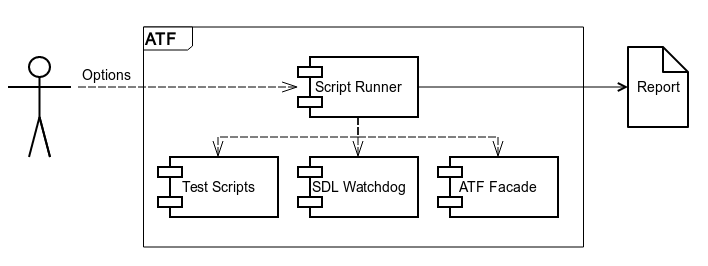

# ATF Script Runner

* Proposal: [SDL-NNNN](NNNN-atf-script-runner.md)
* Author: [Dmytro Boltovskyi](https://github.com/dboltovskyi)
* Status: **Awaiting review**
* Impacted Platforms: [ATF]

## Introduction

ATF is a great tool for both developers and testers that helps to test SDL functionality.
But it lacks a powerful test script runner.

## Motivation

Currently ATF is unable to:

  - run multiple test scripts
  - run test script in parallel
  - create test reports in standard format

The purpose of this proposal is to develop extended script runner as part of ATF package.

## Proposed solution

Script runner is a command line tool with the following features:

  - An option to run single test script
  - An option to run batch of test scripts
  - An option to run test set
  - Possibility to run test scripts in parallel (in separate threads)
  - Ability to create reports with logs collected in a format used by continuous integration system

Input data could be defined as a set of input parameters and options.

Functionality of 'SDL Watchdog' and 'ATF Facade' is described in other proposals.

## Potential downsides

N/A

## Impact on existing code

No impact on existing code is observed since script runner is a new module.

## Alternatives considered

Refactoring of existing runner (bash script), but it will negotiate current big base of test artifacts.
