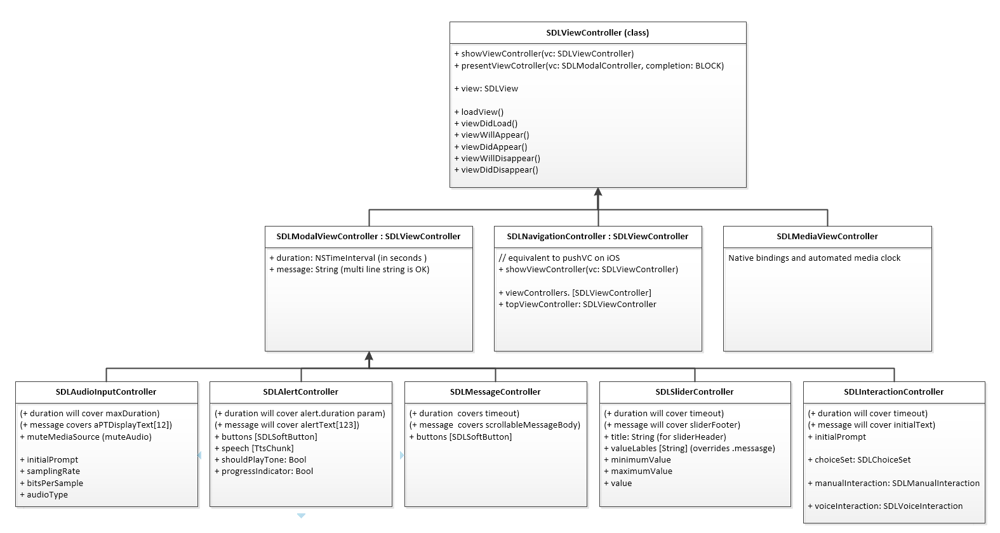

# High level interface: Foundation

* Proposal: [SDL-NNNN](NNNN-high-level-interface-foundation.md)
* Author: [Kujtim Shala](https://github.com/kshala-ford)
* Status: **Awaiting review**
* Impacted Platforms: [ iOS ]

## Introduction

This proposal is about setting up a foundation to provide a high level developer interface to the iOS library. A separate proposal will address the high level Android interface. It proposes a solution to mimic the UI framework of the native OS SDKs. It contains an overview and basic design but won't go much into details of a specific section. Subsequent proposal will be created in the near future in order to provide detailed designs whenever necessary.

As discussed in the steering committee meeting from March 20 (see [here](https://github.com/smartdevicelink/sdl_evolution/issues/379#issuecomment-374736496)) this proposal is a counterproposal to [0133 - Enhanced iOS Proxy Interface](https://github.com/smartdevicelink/sdl_evolution/blob/master/proposals/0133-EnhancediOSProxyInterface.md).

## Motivation

In order to work with SDL app developers need to learn a new API which mostly doesn't adopt familiar patterns. Including but not limited to 
- read best practices and implement proxy lifecycle (Android above all)
- the use of RPCs and handle notifications, requests and responses
- manually manage concurrent and sequential operations (e.g. image upload)

The time for an app developer to learn SDL (non-productive time) is high and not accepted by some developers. The SDL iOS library already improves the current situation by abstracting painful implementations. However the management layer is still unfamiliar and causes a high learning curve.

## Proposed solution

This proposal is about adding a new abstraction layer which utilizes the management layer and provides a high level interface familiar to the UIKit famework in iOS and Activity package in Android.

| High level interface |
|----------------------|
| Management layer     |
| Proxy layer          |
| Protocol layer       |
| Transport layer      |

The high level interface sits on top of the management layer. It should provide classes like 
- SDL Application to abstract SDL-centric application lifecycle including HMI status, capabilities, language etc. 
- SDL ViewController (iOS) or Activity (Android) to allow architecture SDL use cases beyond todays possibilities (incl. UI stack)
- SDL View with subclasses to simplify the HMI screen manipulation throughout the UI stack

### Application lifecycle
---

This subsection is not complete but provides an descriptive overview to avoid confusion. If agreed by the steering committee the details of the application lifecycle will be proposed separately.

#### SDLApplication (mimic UIApplication)

The application lifecycle `SDLApplication` should utilize the lifecycle manager and provide 
- a state machine abstracting transitions of the HMI level, audio streaming state etc.
- properties to access (appliation related) capabilities (from `RegisterAppInterfaceResponse` or `GetSystemCapabilities`)
- refer to an SDL view controller manager which will be used to stack view controllers starting with the root view controller. 

#### SDLAppState (mimic UIApplicationState)

Inspired by [`UIApplicationState`](https://developer.apple.com/documentation/uikit/uiapplicationstate) an SDL application can behave very similar to a native iOS app

```objc
typedef SDLEnum SDLAppState SDL_SWIFT_ENUM;
extern SDLAppState const SDLAppStateActive; // Equivalent to HMI_FULL
extern SDLAppState const SDLAppStateInactive; // Equivalent to HMI_LIMITED
extern SDLAppState const SDLAppStateBackground; // Equivalent to HMI_BACKGROUND
extern SDLAppState const SDLAppStateNotRunning; // Equivalent to HMI_NONE
extern SDLAppState const SDLAppStateDisconnected; // Equivalent to not connected/registered
```

#### SDLAppDelegate (mimic UIApplicationDelegate)

This protocol corresponds to [UIApplicationDelegate](https://developer.apple.com/documentation/uikit/uiapplicationdelegate) and provides method called on certain commonly used transitions. All of the transitions would also be notified through the notification center.

The purpose of the protocol is to improve the learning curve of possible HMI level transitions by reducing the number of possible transitions.

*AppDelegate protocol*

```objc
@protocol SDLAppDelegate
@optional
- (void)appDidConnect:(SDLApplication *)app;
- (void)appDidDisconnect:(SDLApplication *)app;

- (void)appDidFinishLaunch:(SDLApplication *)app;
- (void)appDidClose:(SDLApplication *)app;

- (void)appDidBecomeInactive:(SDLApplication *)app;
- (void)appDidBecomeActive:(SDLApplication *)app

- (void)appDidEnterBackground:(SDLApplication *)app;
@end
```

*Transition flow*


*Transition table*

| From          | To            | Delegate call(s)                                                      | Case/Example                                                          |
|---------------|---------------|-----------------------------------------------------------------------|-----------------------------------------------------------------------|
| Any level     | Not connected | `appDidDisconnect:`                                                   | Phone's disconnected                                                  |
| Not connected | NONE          | `appDidConnect:`                                                      | App just registered                                                   |
| BACKGROUND    | NONE          | `appDidClose:`                                                        | Background app was closed                                             |
| LIMITED       | NONE          | `appDidClose:`                                                        | Active media app was closed by the user while HMI is e.g. in Nav      |
| FULL          | NONE          | `appDidClose:`                                                        | App was closed by the user                                            |
| Not connected | BACKGROUND    | `appDidConnect:`<br>`appDidFinishLaunch:`<br>`appDidEnterBackground:` | App with background service just registered                           |
| NONE          | BACKGROUND    | `appDidFinishLaunch:`<br>`appDidEnterBackground:`                     | App just got permission to serve in background                        |
| LIMITED       | BACKGROUND    | `appDidEnterBackground:`                                              | Active media app was closed as the user selected another media app    |
| FULL          | BACKGROUND    | `appDidBecomeInactive:`<br>`appDidEnterBackground:`                   | Non-media app is backgrounded as the user moved to e.g. media         |
| Not connected | LIMITED       | `appDidConnect:`<br>`appDidFinishLaunch:`<br>`appDidBecomeInactive:`  | Media app resumed after ignition cycle while HMI is e.g. in Nav       |
| NONE          | LIMITED       | `appDidFinishLaunch:`<br>`appDidBecomeInactive:`                      | ?                                                                     |
| BACKGROUND    | LIMITED       | `appDidBecomeInactive:`                                               | ?                                                                     |
| FULL          | LIMITED       | `appDidBecomeInactive:`                                               | Media app was background as the user moved to e.g. Nav                | 
| Not connected | FULL          | `appDidConnect:`<br>`appDidFinishLaunch:`<br>`appDidBecomeActive:`    | Media app resumed after ignition cycle and became visible on HMI      |
| NONE          | FULL          | `appDidFinishLaunch:`<br>`appDidBecomeActive:`                        | App was selected by the user (or system)                              |
| BACKGROUND    | FULL          | `appDidBecomeActive:`                                                 | Background app was selected by the user                               |
| LIMITED       | FULL          | `appDidBecomeActive:`                                                 | Active media app was selected by the user                             |

### View Controller lifecycle
---

Based on the MVC pattern used by UIKit the high level interface should introduce the SDL view controller in order to manage and control views. App developers need to subclass the base view controller class and implement the use cases. As view controllers are stackable the app developer can separate and structure the SDL related code.

A view controller can exist in a set of states. Below flow shows the possible transitions between loading view, view to appear or to disappear.




#### `Init`

View controllers are instantiated when they are pushed to the view controller manager. In the case of the root view controller it would be instantiated once a connection is established to the head unit (app is registered). In this state there is no view loaded. The app developer should not load data or perform other memory/time intense code at this time.

#### `loadView`

In case the view controller appears on the screen but does not have a loaded view the method `loadView` is called which should be overriden by the app developer in the subclass.

#### `viewDidLoad`

After calling `loadView` the view controller is notified that the view did load. The app developer can override this method in order to load data sources and apply assets to the view.

#### `viewWillAppear`

Whenever a view controller's view should become visible on the head unit the view controller will be notified that the view will appear. Reasons to appear on the head unit are:
1. The app launched and became (in)active (entered HMI_LIMITED or HMI_FULL). The root view controller will appear.
2. The app has pushed a second view controller to the stack. The second view controller's view will appear after the first view controller's view will disapper.
3. The top view controller was removed from the stack. The underlying view controller's view will appear after the top view controller's view will disappear.

The app developer can override this method in order to manipulate view elements before they are presented on the head unit.

#### `viewDidAppear`

This method is called after `viewWillAppear` and after the view related RPCs (`Show`, `SetDisplayLayout` etc.) are all performed.

#### `viewWillDisappear`

Whenever a view is/will not be visible on the head unit anymore the view controller will be notified by `viewWillDisappear`. Reasons for that are:
1. The app entered HMI_NONE or HMI_BACKGROUND. In this case the view already disappeared. Still in order to follow the flow this method should be called.
2. The app has pushed a second view controller to the stack. The first view controller's view will disappear before the second view controller's view will appear.
3. The top view controller was removed from the stack. The top view controller's view will disappear before the underlying view controller's view will appear.

#### `viewDidDisappear`

This method is called after `viewWillDisappear`. 

### SDLViewController

The base class provides empty overridable methods in order to load a view or being notified when a view did load or if will/did appear/disappear. 

```objc
@interface SDLViewController

@property (nonatomic, readonly) BOOL isViewLoaded;

@property (nonatomic) SDLView *view;

@property (nonatomic, copy) NSString *layout; // SetDisplayLayout

- (void)loadView;
- (void)viewDidLoad;

- (void)viewWillAppear;
- (void)viewDidAppear;

- (void)viewWillDisappear;
- (void)viewDidDisappear;

- (void)showViewController:(SDLViewController *)viewController;
- (void)presentModalViewController:(SDLModalViewController *)modalViewController completion:(void (^)(void))completion; //completion type TBD

@end
```

### SDLViewControllerManager

View controllers should be stackable. Similar to [`UINavigationController`](https://developer.apple.com/documentation/uikit/uinavigationcontroller) an SDL view controller manager should be used by the SDL application class. Different to `UINavigationController` there should not be an `SDLNavigationController`. First of all the navigation controller provides UI elements (no Navigation buttons or Toolbar) which cannot be adoped to SDL. Second to avoid confusion the code responsible for the stack should not be called navigation. (An alternative for `SDLNavigationController` or `SDLStackViewController` can be added if requested).

The view controller manager provides methods to access view controllers and manipulate the view controller stack.

```objc
@interface SDLViewControllerManager

@property (nonatomic, copy) NSArray<SDLViewController *> *viewControllers;

@property (nonatomic) SDLViewController *rootViewController;
@property (nonatomic) SDLViewController *topViewController;
@property (nonatomic) SDLModalViewController *presentedModalViewController;

- (void)pushViewController:(SDLViewController *)viewController;
- (void)popViewController;

- (void)presentModalViewController:(SDLModalViewController *)modalViewController completion:(void (^)(void))completion; //completion type TBD

@end
```

### Modal view controllers

Modal view controllers are responsible for overlay related RPCs such as `Alert`, `ScrollableMessage`, `PerformAudioPassThru`, `Slider` or `PerformInteraction`. Implementing overlays as modal view controllers would follow the modal-mode presentation of view controllers such as [`UIAlertController`](https://developer.apple.com/documentation/uikit/uialertcontroller).

Apps can use subclasses of the modal view controller within a regular view controller by calling `presentModalViewController:completion:`.

#### SDLModalViewController

This class would be used as the base class for any overlay related RPC. As it inherits `SDLViewController` it is possible to manipulate the head unit during a modal presentation.

```objc
@interface SDLModalViewController : SDLViewController

@property (nonatomic, assign) NSTimeInterval duration; // used throughout all subclasses
@property (nonatomic, copy) NSString *message; // used throughout all subclasses

@end
```

#### SDLAlertController

The alert controller is used to abstract the RPC `Alert`.

```objc
@interface SDLAlertController : SDLModalViewController

@property (nonatomic, copy) NSArray<SDLTTSChunk *> *initialPrompt;
@property (nonatomic, copy) NSArray<SDLSoftButton *> *buttons;

@property (nonatomic) BOOL shouldPlayTone;
@property (nonatomic) BOOL progressIndicator;


@end
``` 

#### SDLAudioInputController

The audio input controller is used to abstract the RPC `PerformAudioPassThru`, `OnAudioPassThru` and `EndAudioPassThru`. The app developer should be able to provide a block which is called for audio data. Furthermore a method called `dismiss` should help to end the audio pass thru.

```objc
@interface SDLAudioInputController : SDLModalViewController

@property (nonatomic, copy) NSArray<SDLTTSChunk *> *initialPrompt;
@property (nonatomic, copy) SDLSamplingRate samplingRate;
@property (nonatomic, copy) SDLBitsPerSample bitsPerSample;
@property (nonatomic, copy) SDLAudioType audioType;
@property (nonatomic) BOOL muteMediaSource;

@property (nonatomic) SDLOnAudioDataBlock onAudioDataBlock;

- (void)dismiss; // sends an EndAudioPassThru in order to stop audio input

@end
```

#### SDLScrollableMessageController

Similar to `Alert` this view controller takes care about the RPC `ScrollableMessage`.

```objc
@interface SDLScrollableMessageController : SDLModalViewController

@property (nonatomic, copy) NSArray<SDLSoftButton *> *buttons;

@end
```

#### SDLSliderController

This controller matches very closely to the view [`UISlider`](https://developer.apple.com/documentation/uikit/uislider). For consitency it makes more sense to treat it as a modal controller. In order to work with the RPC `Slider` it is important to provide the selected value back to the caller. As of UIKit this is not done by using a custom completion handler but simply provide the result in a property of the modal view controller. As per mobile API the property `Slider.sliderFooter` is an array used for two purposes. Either it's a footer (single item) or a list of names representing slider values (number of items must match `.numTicks`). The mobile API allows `numTicks` to be between 2 and 26. With the high level abstraction the modal controller can manage much more value ranges than 1-26. Examples are ranges with negative (or more values than available) which are mapped (and scaled) internally to the available range. Future versions of the mobile API could increase the range which would be managed by the slider controller.

```objc
@interface SDLSliderController : SDLModalViewController

@property (nonatomic, copy) NSString *title; // mapped with Slider.sliderHeader
@property (nonatomic, copy) NSArray<NSString *> *valueLables; // overrides control of SDLModalViewController.message 

// minimumValue and maximumValue map to .numTicks
@property (nonatomic) NSInteger minimumValue;
@property (nonatomic) NSInteger maximumValue;

// maps to `Slider.position`
@property (nonatomic) NSInteger value;

@end
```

#### SDLInteractionController

Together with the `SDLChoiceSetManager` the interaction controller will take care about most of the painful work to deal with choice sets and interactions.

In order to support the app developer a class called `SDLChoiceSet` is used which comes with a choice set manager. The choice set management will be proposed separately as it should be contained in the management layer.

- If `.manualInteraction` is set the controller performs with interaction mode MANUAL_ONLY.
- If `.voiceInteraction` is set the controller  performs with interaction mode VOICE_ONLY.
- If both parameters are seth the controller perform with interaciton mode BOTH.
- Initial prompt is optional and used in any interaction mode

```objc
@interface SDLInteractionController : SDLModalController

@property (nonatomic, copy) SDLChoiceSet *choiceSet;
@property (nonatomic, copy) NSArray<SDLTTSChunk *> *initialPrompt;

@property (nonatomic, copy) SDLManualInteraction *manualInteraction;
@property (nonatomic, copy) SDLVoiceInteraction *voiceInteraction;

@end

@interface SDLManualInteraction

@property (nonatomic) SDLLayoutMode *layout;

@property (nonatomic, copy) SDLKeyboardProperties *keyboardProperties;

@end

@interface SDLVoiceInteraction

@property (nonatomic, copy) NSArray<SDLTTSChunk *> *helpPrompt;
@property (nonatomic, copy) NSArray<SDLTTSChunk *> *timeoutPrompt;

@property (nonatomic, copy) NSArray<SDLVrHelpItem *> *helpItems;

@end
```

### Views

The high level interface introduces three different kind of views: text view, image view and button view. Each view element added to a view controller will be responsible for a parameter of the `Show` RPC.

#### SDLView

```objc
@interface SDLView

@property (nonatomic) NSArray<SDLView *> *subviews;

@end
```

#### SDLTextView

The text view is a view which takes care about any kind of text field modifyable by the `Show` RPC. Main fields are dynamically added (first item used for `mainField1`, second for `mainField2`).

```objc

@interface SDLTextView : SDLView

@property (nonatomic) SDLTextAlignment textAlignment;

@property (nonatomic) NSArray<SDLTextField *> *mainFields;

@property (nonatomic) NSString *statusBar;

@property (nonatomic) NSString *mediaTrack;

@property 

@end

@interface SDLTextField

@property (nonatomic, copy) NSString *text;
@property (nonatomic, copy) NSArray<SDLMetadataType> *metadataTypes;

@end
```

#### SDLImageView

The image view will be used for the primary and secondary graphic in the order added to the view controller's view. The view provided will be automatically scaled depending on the display layout.

```objc
@interface SDLImageView : SDLView

@properties (nonatomic) SDLArtwork *image;

@end
```

#### SDLButtonView

Every button view added to the view controller's view will be used for the soft button array in the `Show` RPC. If desired the app developer can manage the soft buttotn views in a dedicated subview of type `SDLView`.

```objc
@interface SDLButtonView

@property SDLSoftButtonType type;
@property NSString *text;
@property SDLArtwork *image;
@property (setter=setHighlighted) BOOL isHighlighted;
@property SDLSystemAction systemAction; 

@property BLOCK buttonAction;

@end
```

## Potential downsides

The initial workload in order to implement this high level interface is expected to be quite high. Once implemented it is expected that developers will be able to implement SDL into their apps in less time as they would need today. At the end the maintenance of the high level interface may be lower compared to the counterproposal for different reasons.

This proposal mimics the native UI API. Compared to the counterproposal this proposal is not that close to the native UI kit experience. On the other side some SDL specific APIs can be easily abstracted and integrated into the rest of the high level interface.

## Impact on existing code

This proposal will add a total new high level interface layer abstracting many parts of SDL. Existing code should not be affected in a short term but it would make parts of the code obsolete therefore to be deprecated and made private.

## Alternatives considered

There are no other alternatives considered.
