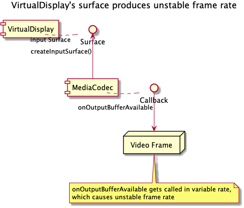
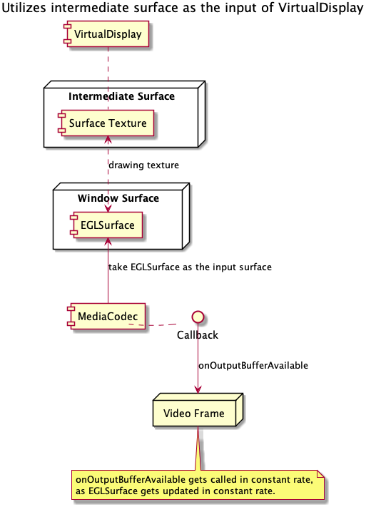

# Improve VirtualDisplayEncoder for stable frame rate

* Proposal: [SDL-NNNN](NNNN-improve-VDE-for-stable-frame-rate.md)
* Author: [Shinichi Watanabe](https://github.com/shiniwat)
* Status: **Awaiting review**
* Impacted Platforms: [Java Suite]

## Introduction

This proposal improve the quality of video projection when using Android VirtualDisplay and MediaEncoder, as Android MediaEncoder does not produce consistent frame rate for rendering VirtualDisplay's surface. 

## Motivation

SDL java_suite (Android) utilizes VirtualDisplay and MediaEncoder to produce the video projection stream. 
Actually, frame rate of video stream depends on how often MediaCodec.Callback gets called.
The component structure is illustrated as follows:

**Fig. 1: VirtualDisplay's surface produces unstable frame rate**

For instance, 
- if an app's content in VirtualDisplay is updated quite often, the MediaEncoder associated with VirtualDisplay's surface produces 60 frames per second.
- if an app's content in VirtualDisplay is not updated very frequently, its surface produces rather few frames (e.g. 20 frames) per second.

Most HUs would be designed for consistent video frame rate, so it may cause some negative effect if video frame rate goes up and down.

This proposal addresses this Android specific issue as it tightly related with how Android VirtualDisplay works.  

## Proposed solution

Because the issue comes from the fact where VirtualDisplay's surface emits output buffer in variable rate, the idea is:

- Give the intermediate surface to VirtualDisplay.
- When VirtualDisplay sends frames, the intermediate surface can determine whether or not to forward them into MediaCodec's input surface.

The approach is introduced at http://stackoverflow.com/questions/31527134/controlling-frame-rate-of-virtualdisplay, i.e.

- Create a SurfaceTexture, construct a Surface from it, and give it to VirtualDisplay.
- When SurfaceTexture fires frameAvailable callback, we can buffer the frame, and render the texture onto the MediaCodec's input surface by using GLES.

The idea is illustrated as follows:
  

**Fig. 2: VirtualDisplay with intermediate Surface**

We can utilize some open source graphic library, like Grafika, to implement this approach.

## Potential downsides

No downside, as it will be implemented in Proxy, and there should be no performance overhead.

## Impact on existing code

Because this approach does not change the API, tehre's no impact to developers who use VirtualDisplayEncoder.

## Alternatives considered

This is pure improvement for existing VistualDisplayEncoder. No alternatives considered.