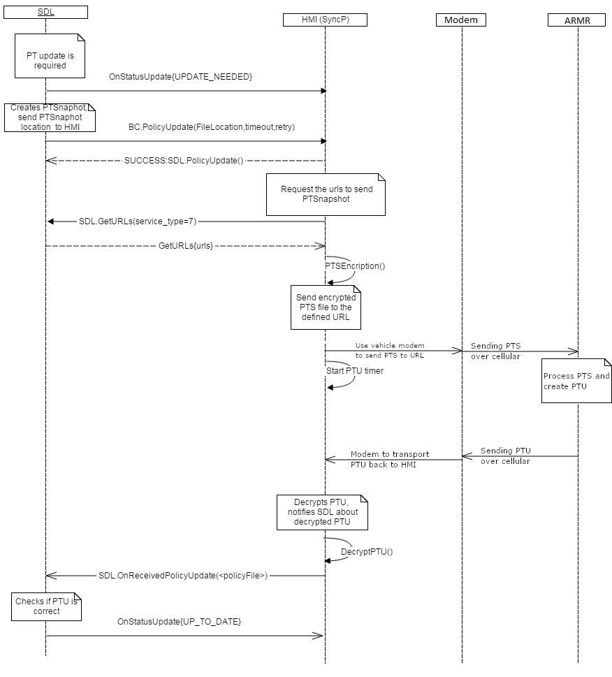
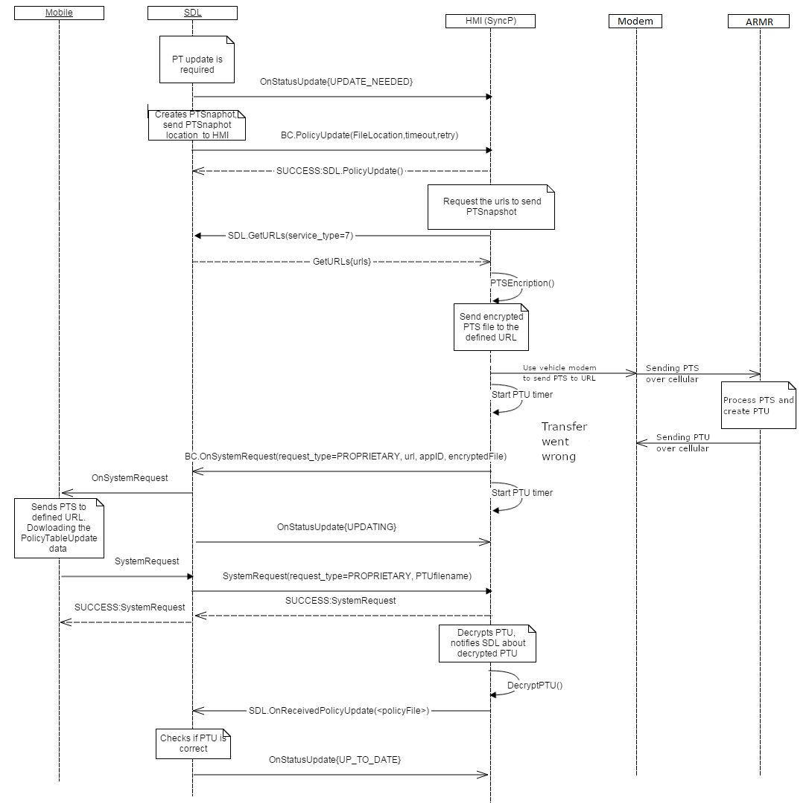
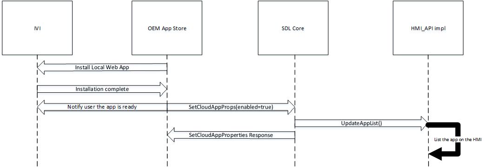
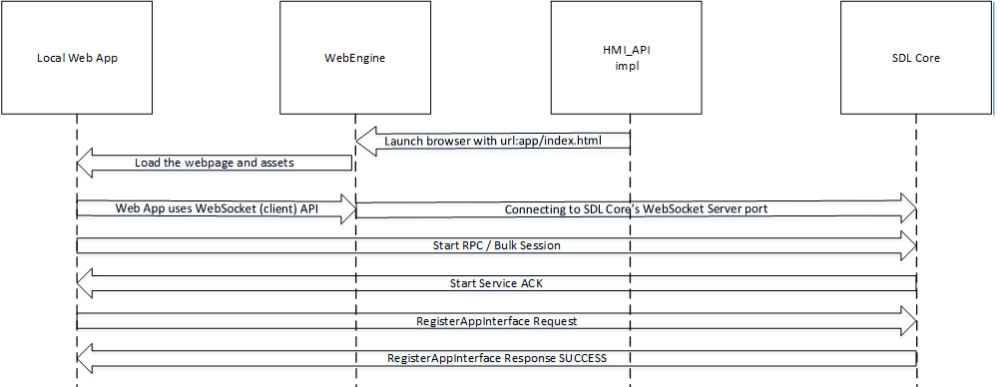

# WebEngine support for SDL JavaScript

* Proposal: [SDL-NNNN](NNNN-sdl-js-pwa.md)
* Author: [Kujtim Shala](https://github.com/kshala-ford)
* Status: **Awaiting review**
* Impacted Platforms: [ Core / RPC / JavaScript / Server / Local ]

## Introduction

This proposal is adding a new transport to the SDL JavaScript library to support (progressive) web apps running on a WebEngine, web view or a browser.

## Motivation

Allowing new user facing applications to run in a vehicle is a big opportunity for SmartDeviceLink to enhance the user experience. Recent browsers allow a hardware independent runtime environment for apps with application management, sandboxing together with decent performance.

## Proposed solution

The proposed solution is to allow apps running in a WebEngine and connect to SDL Core using WebSockets. The WebEngine can be a browser that is reduced to the HTML rendering part only (without url bar, tabs etc.). The WebEngine can be on the local host or in the local network where SDL Core is hosted. The proposed solution based on the cloud app transport adapter with additions to support apps running locally in a sandboxed (browser) environment.

### High level overview 

1. Apps should be made available to the user through an OEM store. The user should be able to install or uninstall apps from the store.
2. An app should be a compressed bundle of application files, such as html, css or script files. At minimum it requires following files
   1. index.html
   2. manifest.json
3. The manifest.json file must be included in the HTML file as a script source
4. The manifest.json file should contain:
   1. SDL app ID
   2. App nicknames
   3. App version
   4. Min SDL version
   5. a relative path to an app icon in the app bundle
5. The OEM store's backend should store the compressed app.
6. If a user installs an app the store should download and decompress the app to the system.
7. The OEM store uses `SetCloudAppProperties` using the manifest data.
   1. The OEM store may choose to set "enabled" parameter to "true" to include the app in the HMI RPC "UpdateAppList".
   2. The OEM store may be setting an auth token if the app requires the store to perform the auth process.
   3. For local apps
      1. "cloudTransportType" will be "ws" (WebSocket) or "wss" (WebSocket-Secure)
      2. "endpoint" parameter will be omitted. Instead the HMI is responsible to launch local apps.
   4. If Core doesn't know the app ID it should ask HMI for a policy update.
8. An app should be able to update the auth token while being registered/activated.
9. The OEM store should be notified about the auth token change.
10. If a user activates a local app through the HMI, the HMI should launch the app by opening the index.html file.
11. HMI should launch the app including SDL Core's hostname and port as GET parameters (file://somewhere/HelloSDL/index.html?ws-host=localhost&ws-port=123456)
12. The app should connect to Core using the SDL library using hostname and port specified.

### Hybrid app preference

Due to a new app platform/location the hybrid app pference should be modified to track mobile, cloud and local apps.

**Mobile API**

```xml
<enum name="HybridAppPreference" since="5.1">
  <description>Enumeration for the user's preference of which app type to use when both are available</description>
  <element name="MOBILE" />
  <element name="CLOUD" />
  <element name="BOTH" deprecated="true" since="5.x">
    <description>This element is deprecated. Using this element will be equal to "ALL". Please use ALL instead.</description>
    <history>
      <element name="BOTH" since="5.1" />
    </history>
  </element>
  <element name="LOCAL" since="5.x" />
  <element name="ALL" since="5.x" />
</enum>
```

The app developer portal should allow a developer to specify an app as a local app. Also as the app platforms increase a new way to specify preferences should be introduced. The element `BOTH` should be deprecated and replaced by `ALL`.

### OEM store and `CloudAppProperties`

There should be an OEM owned app which allows users to discover available apps but also install and uninstall apps. The app appearence and behavior is OEM specific however it should be able to communicate with SDL Core using the HMI API in order to provide cloud app properties of cloud and local apps.

The RPC `SetCloudAppProperties` and all related items should also be included in the HMI_API in order to allow settings app properties from the mobile side but also from the system side (if the OEM store is embedded).

With `BOTH` as an app preference being deprecated on the mobile API, SDL core should translate `BOTH` to `ALL` when forwarding app properties to the HMI.

** HMI_API **

```xml
<interface name="Common" ...>
:
<enum name="HybridAppPreference">
  <description>Enumeration for the user's preference of which app type to use when both are available</description>
  <element name="MOBILE" />
  <element name="CLOUD" />
  <element name="LOCAL"/>
  <element name="ALL"/>
</enum>
</interface>

<interface name="BasicCommunication" ...>
:
<struct name="CloudAppProperties">
  <param name="nicknames" type="String" minlength="0" maxlength="100" array="true" minsize="0" maxsize="100" mandatory="false">
      <description>An array of app names a cloud app is allowed to register with. If included in a SetCloudAppProperties request, this value will overwrite the existing "nicknames" field in the app policies section of the policy table.</description>
  </param>
  <param name="appID" type="String" maxlength="100" mandatory="true"/>
  <param name="enabled" type="Boolean" mandatory="false">
      <description>If true, cloud app will be included in HMI RPC UpdateAppList</description>
  </param>
  <param name="authToken" type="String" maxlength="65535" mandatory="false">
      <description>Used to authenticate websocket connection on app activation</description>
  </param>
  <param name="cloudTransportType" type="String" maxlength="100" mandatory="false">
      <description>Specifies the connection type Core should use</description>
  </param>
  <param name="hybridAppPreference" type="HybridAppPreference" mandatory="false">
      <description>Specifies the user preference to use the cloud app version or mobile app version when both are available</description>
  </param>
  <param name="endpoint" type="String" maxlength="65535" mandatory="false">
      <description>Specifies the endpoint which Core will attempt to connect to when this app is selected</description>
  </param>
</struct>

<function name="SetCloudAppProperties" messagetype="request">
  <description>
    HMI > SDL. RPC used to enable/disable a cloud application and set authentication data
  </description>
  <param name="properties" type="CloudAppProperties" mandatory="true">
    <description> The new cloud application properties </description>
  </param>
</function>

<function name="SetCloudAppProperties" messagetype="response">
  <description>The response to SetCloudAppProperties</description>
  <param name="success" type="Boolean" platform="documentation" mandatory="true">
    <description> true if successful; false if failed </description>
  </param>
  <param name="resultCode" type="Result" platform="documentation" mandatory="true">
    <description>See Result</description>
    <element name="SUCCESS"/>
    <element name="INVALID_DATA"/>
    <element name="OUT_OF_MEMORY"/>
    <element name="TOO_MANY_PENDING_REQUESTS"/>
    <element name="GENERIC_ERROR"/>
    <element name="DISALLOWED"/>
    <element name="WARNINGS"/>
  </param>
</function>

<function name="GetCloudAppProperties" messagetype="request">
  <description>
    HMI > SDL. RPC used to get the current properties of a cloud application
  </description> 
  <param name="appID" type="String" maxlength="100" mandatory="true"></param>
</function>

<function name="GetCloudAppProperties" messagetype="response">
  <description>The response to GetCloudAppProperties</description>
  <param name="properties" type="CloudAppProperties" mandatory="false">
    <description> The requested cloud application properties </description>
  </param>
  <param name="success" type="Boolean" platform="documentation" mandatory="true">
    <description> true if successful; false if failed </description>
  </param>
  <param name="resultCode" type="Result" platform="documentation" mandatory="true">
    <description>See Result</description>
    <element name="SUCCESS"/>
    <element name="INVALID_DATA"/>
    <element name="OUT_OF_MEMORY"/>
    <element name="TOO_MANY_PENDING_REQUESTS"/>
    <element name="GENERIC_ERROR"/>
    <element name="DISALLOWED"/>
    <element name="WARNINGS"/>
  </param>
</function>

<function name="OnCloudAppPropertiesChange" messagetype="notification">
  <description>
    SDL > HMI. RPC used to inform HMI about app properties change (such as auth token).
  </description>
  <param name="properties" type="CloudAppProperties" mandatory="true">
    <description> The new cloud application properties </description>
  </param>
</function>
</interface>
```

### Policy table update

With app properties being set by the OEM store, SDL Core may require a policy table update. The [HMI documentation for OnSystemRequest](https://smartdevicelink.com/en/docs/hmi/master/basiccommunication/onsystemrequest/) shows sequence diagrams of how the update can be performed today. With the transport adapter the vehicle has the own modem to communicate over the internet, therefore can be able to perform the update without the need of a mobile app. 

The cloud app transport adapter proposal includes a use case that describes how a policy server with transport adapter enhancements can update the policy table (see [here](https://github.com/smartdevicelink/sdl_evolution/blob/master/proposals/0158-cloud-app-transport-adapter.md#example-use-case-2)).

SDL Core should trigger a policy update after a new and unknown appID is entered from a `SetCloudAppProperties` request or after a new app has registered. In addition to the existing update procedures, the HMI should be able to perform an update request without sending a system request back to SDL Core. 



> Diagram showing an additional way to perform a policy table update using the vehicle modem.

SDL Core logic should be changed to allow triggering policy updates without any connected applications. This should be a configurable option in the smartDeviceLink.ini file. The configuration flag should be located in the `[HMI]` section and could be called `SupportsPolicyUpdate`. The flag can be set to `true` or `false` (defaults to `false`).

In case the policy updates fails using the in-vehicle modem, the HMI should still be able to return the policy table snapshot with a system request to SDL. This would allow a fallback to the existing sequence using mobile phones to transfer the policy table.



> Diagram showing an additional way to perform a policy table update using the vehicle modem.

### WebSocket transport

This proposal introduces a new runtime environment; the WebEngine. Data communication protocols are very limited in this environment. Therefore a new transport implementation should be introduced to SDL Core and the JavaScript library. 

The transport for Core should be a WebSocket server which listens to a port specified in the smartDeviceLink.ini file. While SDL Core is operating the server should be permanently available and listen for connections on the specified port. Another ini configuration should allow binding the socket to the localloop address or any address. This increases security in production environment and allows remote connection in development systems.

On the library side a new transport based on a WebSocket client should be created using the [WebSocket API](https://developer.mozilla.org/en-US/docs/Web/API/Websockets_API). This transport requires a hostname or ip address with a port to connect to Core's WebSocket server.

### JavaScript library

As described above the JavaScript library should be extended with a new transport. The library should also be extended to be exportable to a single .js file that can be included in an HTML file. This export could be done per library release using Webpack.

This new transport should be specifically for WebEngine purposes and should not be included for the Node.js platform. In order to improve simple "plug-an-play" of the library, the .js file should include only this single transport.

### Local web app installation

If a user selects an app from the OEM store to be installed, the OEM store would notify SDL Core about the new app. The new app should appear in a dimmed state during the installation. 



> Flow of installing a web app on the infotainment system.

### Local web app activation

Activating a local web app by a user will cause the HMI to launch the app's index.html file in the WebEngine. Once the engine has loaded the web page the JavaScript SDL library will initiate a WebSocket connection to SDL Core's 



> Flow of how a user activates a web app and how it gets visible on the screen.

### App presentation

There should be two different graphical user interfaces available to WebEngine based apps. The traditional template based user interface and the approach using the app's document object (HTML page).

#### Templates

The default app presentation approach should be template based. With the web app becoming active on the HMI, the HMI should not present the app's HTML document object. The body of the index.html file of the web app should be empty and should not be modified with scripts as the app won't be visible on the HMI. The HMI shold show the system component responsible of SDL templates. This component would receive the `Show` RPCs provided by the app.

#### Open HMI

A new App HMI type called `OPEN_HMI` should be introduced. When apps with this HMI type are activated, the HMI should make the web page of this app visible on the screen. This web page will become the main window of the application. The window capabilities of this open main window will be empty except of the window ID and physical button capabilities. `Show` requests that address the main window won't have any affect to the HMI. If the app sends this request, Core should return an unsuccessful response with the result code `RESOURCE_NOT_AVAILABLE`. The info field should note that the app is registered with an open HMI. Widgets are still available and can be controlled using `Show`. Any overlay like Alert, ChoiceSets, Slider etc. are also available to the application.


> Screenshot shows a local web app presenting the user interface with the HTML renderer of the WebEngine.

**Mobile and HMI API**

```xml
<enum name="AppHMIType" since="2.0">
  :
  <element name="OPEN_HMI" since="5.x">
</enum>
```

## Potential downsides

The upside of apps running with a WebEngine is that it comes with an extremely flexible html based user interface and with a very sandboxed runtime environment. This can also be seen as downsides as the responsibility of following driver distraction rules increases and that a sandbox environment is limiting the functionality of apps.

## Impact on existing code

1. This proposal is using many pieces of the cloud app transport adapter but outside of a cloud app.
2. The transport adapter needs to support both WebSocket Client<->Server sequences.
3. Core needs a new transport type to support a WebSocket Server.
4. The JavaScript library needs a new transport type to support WebSocket Client.

## Alternatives considered

No other altnernatives considered.
