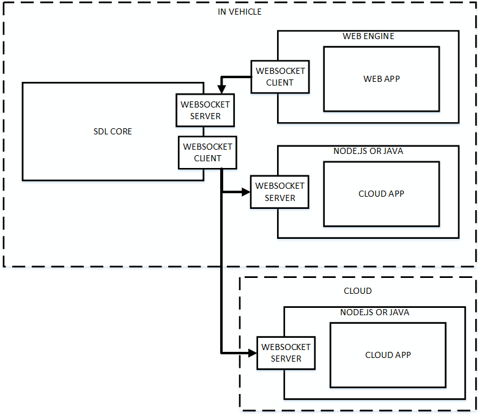
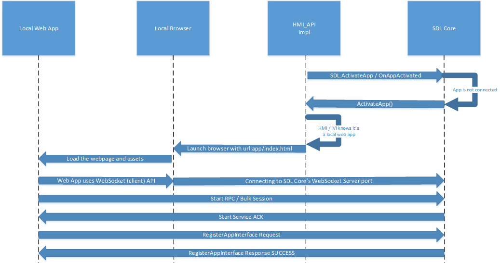

# WebEngine & WebView support for SDL JavaScript

* Proposal: [SDL-NNNN](NNNN-sdl-js-pwa.md)
* Author: [Kujtim Shala](https://github.com/kshala-ford)
* Status: **Awaiting review**
* Impacted Platforms: [ Core / RPC / JavaScript / Server / Local ]

## Introduction

This proposal is adding a new transport to the SDL JavaScript library to support (progressive) web apps to run on a WebEngine, web view or a browser.

## Motivation

Applications running in vehicle opens big opportunities for SmartDeviceLink enhancing the user experience. Recent browsers allow a hardware independent runtime environment for apps with application management, sandboxing together with decent performance.

## Proposed solution

The proposed solution is to allow web apps to run in a WebEngine and connect to SDL Core using WebSockets. A web app is a single page application developed with web technology like HTML, CSS and JavaScript. The WebEngine can be a browser that is reduced to the HTML rendering part only (without url bar, tabs etc.). The WebEngine should be on the same host as SDL Core (in the infotainment system). It can also be in the local network for development purposes.

### High level overview 

1. An OEM store should make apps available to the user. The user should be able to install or uninstall apps from the store.
2. An app should be a compressed bundle of application files, such as HTML, css or script files. At minimum it requires following files
   1. sdl.js file
   2. manifest.json file
   3. An HTML file where the manifest is pointing to
3. The manifest.json file must be included in the HTML file as a script source
4. The OEM store's backend should store the compressed app.
5. If a user installs an app, the OEM store should download and decompress the app to the system.
6. After installation, the OEM store should make the app visible and available on the HMI.
7. Core should support a WebSocket Server as a transport.
8.  If a user activates a local app through the HMI, the HMI should launch the app by opening the index.html file.
9.  HMI should launch the app including SDL Core's hostname and port as GET parameters (file://somewhere/HelloSDL/index.html?ws-host=localhost&ws-port=123456)
10. The app should connect to Core using the SDL library using hostname and port specified.
11. If Core sends UpdateAppList, the HMI should compare matching SDL app IDs and avoid showing an app twice.



> An overview of application runtime environment and how they connect to SDL Core. This proposal adds the WebEngine part.

### Hybrid app preference

Due to a new app platform, the hybrid app prefence should be modified to track mobile, cloud and local apps.

**Mobile API**

```xml
<enum name="HybridAppPreference" since="5.1">
  <description>Enumeration for the user's preference of which app type to use when both are available</description>
  <element name="MOBILE" />
  <element name="CLOUD" />
  <element name="BOTH" deprecated="true" since="5.x">
    <description>This element is deprecated. Using this element will be equal to "ALL". Please use ALL instead.</description>
    <history>
      <element name="BOTH" since="5.1" />
    </history>
  </element>
  <element name="LOCAL" since="5.x" />
  <element name="ALL" since="5.x" />
</enum>
```

The app developer portal should allow a developer to specify an app as a local web app. As the app platforms increase (2 -> 3) a new way to specify preferences should be introduced. The element `BOTH` should be deprecated and replaced by `ALL`.

### WebSocket transport

This proposal introduces a new runtime environment; the WebEngine. Data communication protocols are very limited in this environment. Therefore a new transport implementation should be introduced to SDL Core and the JavaScript library. 

The transport for Core should be a WebSocket server which listens to a port specified in the smartDeviceLink.ini file. While SDL Core is operating the server should be permanently available and listen for connections on the specified port. Another ini configuration should allow binding the socket to the localloop address or any address. This increases security in production environment and allows remote connection in development systems.

On the library side, a new WebSocket client transport should be created using the [WebSocket API](https://developer.mozilla.org/en-US/docs/Web/API/Websockets_API). This transport requires a hostname or ip address with a port to connect to Core's WebSocket server.

### JavaScript library

As described above the JavaScript library should be extended with a new transport. The library should also be extended to be exportable to a single .js file that can be easily included in an HTML file. This export could be done per library release using Webpack.

This new transport should be specifically for WebEngine purposes and should not be included for the Node.js platform. In order to improve simple "plug-an-play" of the library, the .js file should include only this single transport.

### Web application package

With installing an app on the infotainment system there should be a minimum set of requirements on how the app should be packaged.

1. The app package should be a compressed zip file
2. It should contain a manifest.json and the sdl.js file
3. The manifest file should contain:
   1. a relative path to an html file which is the entry point of the app
   2. a relative path to an app icon in the app bundle
   3. SDL app ID
   4. app name
   5. optionally per supporting SDL locale:
      1. app name (overrides global app name) (must be one of the valid app nicknames)
      2. optionally relative path to an app icon (overrides global app icon)
      3. optionally TTS name (an array of tts chunks)
      4. optionally VR app names (an array of strings)
   6. App version
   7. Min SDL version supported
4. All script files should be included in the package
   1. Any `<script>` element with `src` attribute should point to a script file in the package
   2. No scripts from outside the package should be allowed
5. A whitelist of urls the app want to access
6. The entry point HTML file should refer to the manifest file (`<script src="manifest.json" />`)

Above metadata may be used for the OEM app store and for presenting the app on the HMI (including voice capability).

This definition should ensure that apps can be approved and verified by SDLC and OEMs without possibility of modifications after approval. Also this set of requirements should ensure compatibility throughout integrators. The final approval process will be part of another proposal.

### Activating a web app

Activating a local web app by a user will cause the HMI to launch the app's index.html file in the WebEngine. Once the engine has loaded the web page the JavaScript SDL library will initiate a WebSocket connection to SDL Core's 



> Flow of how a user activates a web app and how it gets visible on the screen.

### App presentation

There should be two different graphical user interfaces available to WebEngine based apps. The traditional template based user interface and the approach using the app's document object (HTML page).

#### Templates

The default app presentation approach should be template based. With the web app becoming active on the HMI, the HMI should not present the app's HTML document object. The body of the index.html file of the web app should be empty and should not be modified with scripts as the app won't be visible on the HMI. The HMI shold show the system component responsible of SDL templates. This component would receive the `Show` RPCs provided by the app.

#### Open HMI

A new App HMI type called `OPEN_HMI` should be introduced. When apps with this HMI type are activated, the HMI should make the web page of this app visible on the screen. This web page will become the main window of the application. The window capabilities of this open main window will be empty except of the window ID and physical button capabilities. `Show` requests that address the main window won't have any affect to the HMI. If the app sends this request, Core should return an unsuccessful response with the result code `RESOURCE_NOT_AVAILABLE`. The info field should note that the app is registered with an open HMI. Widgets are still available and can be controlled using `Show`. Any overlay like Alert, ChoiceSets, Slider etc. are also available to the application.


> Example of a local web app presenting the user interface with the HTML renderer of the WebEngine.

**Mobile and HMI API**

```xml
<enum name="AppHMIType" since="2.0">
  :
  <element name="OPEN_HMI" since="5.x">
</enum>
```

Using the new HMI type would be policy controlled. Only apps with permissions to use this new HMI type would be allowed to register.

## Potential downsides

The upside of apps running with a WebEngine is that it comes with an extremely flexible html based user interface and with a very sandboxed runtime environment. This can also be seen as downsides as the responsibility of following driver distraction rules increases and that a sandbox environment is limiting the functionality of apps.

## Impact on existing code

1. Core needs a new transport type to support a WebSocket Server.
2. The JavaScript library needs a new transport type to support WebSocket Client.
3. Developer site needs a new field for local apps.


## Alternatives considered

An additional (alternative) feature considered is to use cloud app transport adapter to inform Core about a new app installation. Originally this concept was part of this proposal. However it was removed from this proposal as the cloud app transport adapter is designed for the concept of Core being a client to connect to apps being the server.
