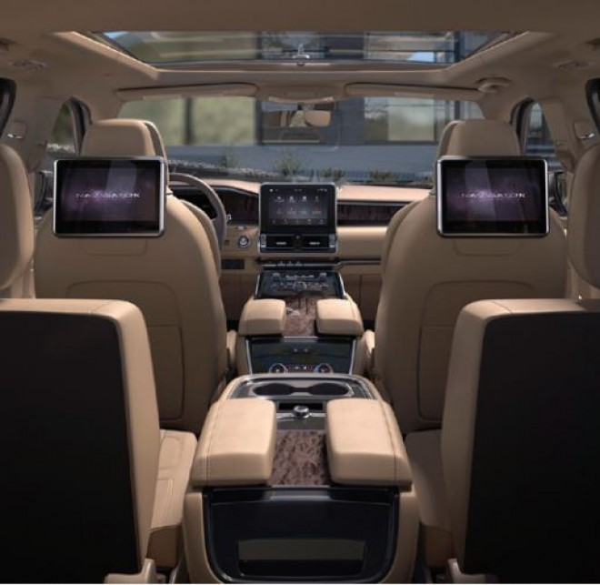

# Widget support

* Proposal: [NNNN](NNNN-widget-support.md)
* Author: [Ashwin Karemore](https://github.com/ashwink11), [Kujtim Shala](https://github.com/kshala-ford)
* Status: **Review ready**
* Impacted Platforms: [Core / iOS / Android / Web / RPC ]

## Introduction

This proposal is about widget support for SDL applications on modern infotainment systems and large displays. At the same time the proposed feature should prepare SDL for multi screen and multi display support. 

## Motivation

As provided in other app platforms, app widgets are useful to quickly interact with apps and features. With modern infotainment systems and larger displays, SDL can offer a small representation of a registered application.

### Overall vision: Multi display support

Providing Widget support has been identified as a concept that can be extended to support multiple displays including clusters, heads up and rear seat entertainment systems. The long-term vision of this proposal is to provide mutli-screen and multi-display support. This means that one app should not only be able to have multiple screens of different types on one display but also address other displays inside the vehicle.



### First step: Widgets on main display

This proposal is focusing on main display widgets only but provides futuristic APIs to control apps on multiple displays. Future proposals will extend the APIs of this proposal to provide information about available displays, their type and position and of course the display capabilities.

### Next steps or Future proposals

The future proposals will be about:

Redesigning display capabilities: Allow apps to request system capabilities regarding displays, screens and seats so that apps know what displays are available, the display type (center stack, cluster, head-up, head-rest etc.), size etc. Additionally, what types of screens the display supports, where the display is located and what seats (and therefore persons) can reach and use the display.

Analyzing RPCs and their relation to displays and screens: Today in the vehicle, SDL works as a system with a single main display and a single main app screen. OEMs reuse some assets from the main app screen and present it in other areas in the vehicle. We have to analyze and understand how RPCs are affected by having multiple screens with multiple displays. A future proposal will solve how HMI levels will work on multiple displays and what RPCs are system, display or even screen specific.

## Proposed solution

In current SDL implementations the registered application always comes with a single default screen that shows the app content. 
In a nutshell the solution is to allow multiple screens per app. Each screen can be individually addressed and can be shown on a single display or on multiple displays. For convenience it should be possible to enable content duplication of another screen.

The below image shows SYNC3 with an app screen being part of the display. The SYNC3 display in the center stack is the main display of the SDL system. The highlighted area is the viewport of app screens. Each app has one single main app screen that is presented on the SYNC3 display on user selection. Selecting another app will cause the display to show the screen of the other app. If that screen is visible, the app is defined as in HMI level FULL.


It should not be part of the proposal to specify where widgets are located. It is the OEMs responsibility and decision on how and where widgets are presented (if the OEM chooses to support widgets). They could be listed on the IVI home screen, in the apps domain or next to the main app screen area.


### Apps, Displays, Screens

As of today, once an SDL app registers it gets a default screen allocated on the IVI head unit. Strictly speaking the `Show` RPC is manipulating the content presented in the single default screen. For media apps, some IVI reuse/repeat the content on clusters or on IVI overview screens (e.g. SYNC3 home screen). Adding the capability for apps to address a specific screen per Show request allows apps to fill app screens individually.

### Screen management

In order to work with multiple screens, the app needs to be able to create or delete screens. By adding the RPCs `CreateScreen` and `DeleteScreen` the app will be able to manage the screen on the main display.

#### Mobile API

```xml
<function name="CreateScreen" messagetype="request" since="5.1">
  <description>
    Create a new screen on the display with the specified screen type.
  </description>
  <param name="screenID" type="Integer" mandatory="true">
    <description>
      A unique ID to identify the screen.
    </description>
  </param>
  <param name="type" type="ScreenType" mandatory="true" />
  <param name="duplicateScreenID" type="Integer" mandatory="false">
    <description>
      Optional parameter. Specify whether the content of an existing screen should be duplicated
      to the created screen.
    </description>
  </param>
</function>

<function name="CreateScreen" messagetype="response" since="5.1">
  <!-- common response params -->
  <param name="displayCapabilities" type="DisplayCapabilities" mandatory="false" />
  <param name="buttonCapabilities" type="ButtonCapabilities" minsize="1" maxsize="100" array="true" mandatory="false" />
  <param name="softButtonCapabilities" type="SoftButtonCapabilities" minsize="1" maxsize="100" array="true" mandatory="false" />
  <param name="presetBankCapabilities" type="PresetBankCapabilities" mandatory="false" />
</function>

<function name="DeleteScreen" messagetype="request" since="5.1">
  <description>
    Deletes previously created screen of the SDL application.
  </description>
  <param name="screenID" type="Integer" mandatory="true" />
</function>

<function name="DeleteScreen" messagetype="response" since="5.1">
  <!-- common response params -->
</function>

<enum "ScreenType">
<element name="MAIN">
  <description>
    This Screen type describes the main screen on a display.
  </description>
</element>
<element name="WIDGET">
  <description>
    A widget is a small screen that the app can create to provide information and softbuttons for a quick app control.
  </description>
</element>
</enum>

<enum "PredefinedScreens" since="5.1">
<element name="DEFAULT_SCREEN" value="0">
  <description>
    The default screen is a main screen precreated on behalfs of the app.
  </description>
</element>
</enum>
```

#### HMI API

The HMI API should contain:
- a copy of the enums `ScreenType` and `PredefinedScreens` in the "Common" interface
- a copy of the functions `CreateScreen` and `DeleteScreen` in the "UI" interface

#### Create & Delete screen

The RPC `CreateScreen` allows an app to create a new screen on the display. The app needs to specify a screen ID that is used for screen manipulation e.g. with the RPC `Show` and the screen type which can either `MAIN` or `WIDGET` (see sub-section *Screen types*). 

If desired the apps can duplicate content of an existing screen to the created screen using parameter `duplicateScreenID`. All RPCs sent to the screen with the ID equals `dulicateScreenID` will be duplicated for the creating screen. Bidirectional screen content duplication should not be supported. RPCs sent to the creating screen will not be duplicated to the screen with ID equals `duplicateScreenID`. 

After a screen is successfully created the response will contain information and capabilities about the created screen.

#### Screen types

This proposal contains two types of screens.

The main screen is the full size apps screen on a display. An app can have multiple main screens depending on the displays e.g. main screen on the central console and main screen on rear seat entertainment system. However, it should not be allowed to have multiple main screen on a single display. Main screens follow HMI levels and permissions.

The widget screen is a small screen type to provide quick information or shortcut softbuttons. Widgets don't follow HMI levels as main screen. Once a widget is created the all RPCs addressed to this widget follow policies based on HMI_LIMITED. This policy rule is due to the nature of widgets as they can be always available to the user or should be ready to use when accessing the widget area (see alternative solution for widgets with HMI levels).

Still widgets have effects to the HMI level of the app's main screen. Depending on the app policies:

1. Apps can create widgets from any HMI level as allowed by policies (e.g. from HMI_NONE or BACKGROUND) and send `Show` or `SetDisplayLayout` to add content (text and soft buttons) to that widget. The RPCs sent to the widget follow policies of HMI_LIMITED
2. If a user taps on a soft button in the widget and the app main screen is in HMI_NONE the app will automatically transit to HMI_BACKGROUND
3. Exception 1: If the app is a navigation or media app the app will transit to HMI_LIMITED instead. Navigation apps will then be ready to start navigation by starting video and audio serivce. This exception will also make media apps audible.
4. Exception 2: If the app specified the soft button with `STEAL_FOCUS` system action the app will transit to HMI_FULL and the main screen will be shown
5. If a user taps anywhere in the widget but not on a soft button the app will transit to HMI_FULL and the main screen will be shown

#### PredefinedScreens

The enum `PredefinedScreens` specifies what screens and IDs are predefined and precreated on behalf of the app.

The default screen is always available and represents the app screen on the main display. It's an equivalent to the todays app screen. For backward compatibility this will ensure the app always has at least the default screen on the main display. The app can choose to use this predefined enum element to specifically address app's main screen or to duplicate screen content. It is not possible to duplicate another screen to the default screen.

### Screen manipulation

Working on this proposal we grouped all RPCs into three categories: system, display or screen related. The RPC `Show` and `SetDisplayLayout` are identified as the only screen related RPCs. In order to allow an app to address a specific screen these two RPCs need to have an option parameter for the screen ID.

```xml
<function name="Show" functionID="ShowID" messagetype="request" since="1.0">
 :
 :
<param name="screenID" type="Integer" mandatory="false" since="5.1" />
</function>

<function name="SetDisplayLayout" functionID="SetDisplayLayoutID" messagetype="request" since="2.0">
 :
 :
 <param name="screenID" type="Integer" mandatory="false" since="5.1" />
</function>
```

This allows the app to use the full flexibility of the Show RPC in other screens.

### Screen templates

Today, SDL comes with a set of predefined templates available. The information for what templates are available for the apps is provided in 
- `RegisterAppInterfaceResponse.displayCapabilities.templatesAvailable` and 
- `SetDisplayLayoutResponse.displayCapabilities.templatesAvailable`.

Details about the currently selected screen template are part of the display capabilities struct:
- text fields, the name, width etc.
- image fields e.g. graphic, or soft button image resolutions

The template design comes from the head unit. However predefined template names are defined in `PredefinedLayout` enum. The head unit should provide template designs for the predefined template names. Still, it can also provide additional custom templates with self defined names. 

All this can be reused for widget screens. When creating a new widget screen the available widget templates are provided in `CreateScreenResponse.displayCapabilities.templatesAvailable`.

The details about the currently selected widget template are provided using the same display capabilities struct. It is expected that the HMI will return with fewer text fields (only main field 1 and 2), shorter text field width and smaller image resolutions. This proposed solution reuses the existing API to provide widget template details mentioned. Just as today the design for widgets also come from the head unit and the OEM.

Examples for widget screens:

| template name | Example layout |
|-----------------------|----------------------------------------------------------------------------------------------|
| text with graphic  |  |
| graphic with text  |  |
| tiles with graphic |  |

### Screen types supported

In order to inform the app what screen types are supported, the struct `DisplayCapabilities` should be extended with a single optional parameter called `screenTypesSupported`.

```xml
<struct name="DisplayCapabilities" since="2.0">
 :
 <param name="screenTypesSupported" type="ScreenType" array="true" minsize="1" mandatory="false" />
</struct>
```

This parameter does not inform the app how many screens per type are supported but it informs if a display supports widgets or a main app screen. The HMI decides on 
- how many widgets should be displayed (example: limited to 6 or indefinite using a scrollable area) 
- and how to order them (alphabetically, chronogically or based on recent app usage).

## Potential downsides

The current design of SDL does not clearly separate displays and screens. Together with multi-display support there will be a proposal to redesign display and screen capabilities. This proposal should still be valid as it focuses on multi screen only.

## Impact on existing code

On SDL there are additional RPCs that need to be added. The HMI needs to design templates for widgets. This proposal did not focus on the mobile changes. For mobile libraries it's necessary to add the new RPCs and add support for multiple screen managers. This will also be part of a separate proposal.

## Alternatives considered

There are no alternatives considered. App services can be used to define additional widgets/app cards for certain service types such as weather or media.

Below are alternatives to parts of this proposal:

#### Screen related `OnHMIStatus`

In the proposal widget screens should not follow HMI levels. RPCs sent to a widget screen would follow app policies of HMI_LIMITED. This alternative proposes OnHMIStatus for any screen instance.

```xml
<function name="OnHMIStatus" functionID="OnHMIStatusID" messagetype="notification" since="1.0">
  :
  <param name="screenID" type="Integer" mandatory="false" since="5.1" />
</function>    
```

The additional parameter can used by the system to tell the app the HMI level of any screen instance. The parameter should be omitted for the predefined default screen for better backward compatibility. For other screens the screen ID specified by the app should be set in this parameter.

By default widgets created are in HMI_BACKGROUND. This allows the app to fill the widget with content after it's created. If they get visible on the display the HMI should notify the app that the widget is now in HMI_FULL. This can be the case if the driver selects the widget area (e.g. the home screen shows app widgets). As widgets are not launchable the should automatically transit to HMI_FULL once they are visible.

To limit the changes in the RPC and support backward compatibility audioStreamingState should be provided to all screens of one app. The HMI and SDL core must make sure to not send different audio states per app.

System context can be screen related. A widget can be fully visible (system context MAIN) while the app's default screen can present the menu (system context MENU).

#### Screen duplication by SDL libraries

To reduce complexity on the head unit screen duplication can be supported by the SDL libraries. This could allow more flexibility to enable or display duplication for existing screens. However this increases the number of RPCs to be sent by the app and the user might see a delay in screen update (duplication not synchronized).

