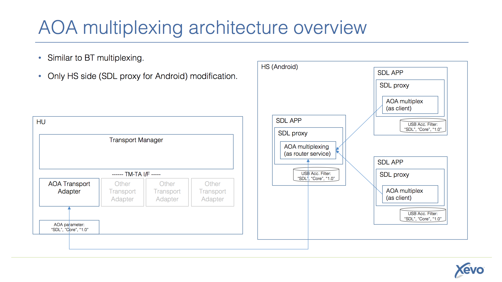

# AOA multiplexing similar to Android BT/SPP multiplexing

* Proposal: [SDL-NNNN](NNNN-AOA-multiplexing.md)
* Author: [Jennifer Hodges](https://github.com/jhodges55)
* Status: Awaiting review
* Impacted Platforms: [ Android ]


## Introduction

Add "multiplexing" to AOA transport. 
This change introduces a better user experience as follows:
- Multiple navigation apps can be selected by user without any operation on HS. It's same as iPhone's UX.
- Non-navigation apps can use not only BT/SPP but AOA as transport. 
- In the future, projection will be applied to not only navigation but also other category app then, multi "projection apps" can be supported.
 NOTICE: It will be depend on HU capability, "Whether multi projection app can be run in parallel (multi view port for each projection app) or not".

## Motivation

Currently, only one AOA app can connect to SDL core because of AOA limitation. However, a few navigation apps will be released. And, video projection functionality will be opened for not only navigation but also other category apps. And not projection but using wide band-width and stable transport apps (ex. using high quality audio streaming or pass thru), may be considered in the future. This proposal is for supporting and realizing these requirements.
 
## Proposed solution

Implement multiplexing functionality to AOA transport of SDL Android library. This architecture is similar to existing BT/SPP multiplexing. However, in Android, SPP and AOA may exist in parallel. So, another multiplexing router service for AOA will be added. SDL core is unnecessary to be changed because SDL core already supported multi session in single transport with using session id.
If HU manufacture supports only multiplexing AOA app then, AOA parameter must be set as "SDL", "Core", __"1.1"__. On the other hands, if HU manufacture supports both multiplexing and single AOA app then, AOA parameter can be set as "SDL", "Core", __"1.0"__.
App which is linked SDL proxy of multiplexing AOA support version, must include accessory_filter.xml as followings:
```
<usb-accessory manufacturer="SDL" model="Core" version="1.0"/>
<usb-accessory manufacturer="SDL" model="Core" version="1.1"/> <!-- AOA multiplexing support -->
```
The spec must be applied to "SDLC web"->Guide->Android->Getting Started->Using AOA protocol.

Optionally, even if some of OEMs/Tier1s are already using AOA for not SDL then, this proposal architecture can be applied with customized SDL Android library which includes customized router service to arbitrate SDL session and proprietary service using AOA.  
ex. proprietary AOA parameter (in customized router service) App + standard AOA parameter Apps.
* Special HU (with proprietary AOA parameter) <-> customized router service <-arbitrate to SDL or proprietary service-> standard SDL apps or proprietary service
* Standard SDL HU (with standard SDL AOA parameter) <-> one of standard SDL app <-> other standard SDL apps.
This is also same architecture to BT/SPP multiplexing.

## Potential downsides

Backward compatibility:  
There is no change in SDL core. So that, new App with new AOA-mutilplexing-SDL-proxy can connect to old HU, too.
However there is issue in only the case of 'old app + new app in HS, and HU AOA parameter is set as __"1.0"__'.

UX will be as follows:  
User can select both new apps and old apps on HS selection dialog (at the first time. If user checked "default" then, automatically selected from next). If one of old app will be selected then, other apps cannot be connected.  
On the other hand, in the case of 'HU AOA parameter is set as __"1.1"__' (support only multiplexing), user can select only new app ("default" behavior is same as above). All of apps can be connected via router service. User can select any apps on HU. Old app (only __"1.0"__ declared in accessory_filter.xml) cannot connect New HU.

So that, recommendation is choose __"1.1"__ as AOA parameter, to avoid user confusion.

Case Matrix is as follows:  
In the case of New AOA parameter "SDL","Core",__"1.1"__:
- Case: "old apps + new apps": "old apps" cannot be activated because of different accessory parameter. Only one new app can be router of AOA, other new apps can connect via router.
- Case: "old apps" only: old apps __cannot__ connect.
- Case: "new apps, no old apps": normal case, all apps can connect.

In the case of same AOA parameter "SDL","Core",__"1.0"__:
- Case: "old apps + new apps": if end-user choose one of "old apps" in Android user confirmation dialog "which app should be used for this accessory" then, only one of old apps can connect. If end-user choose one of "new apps" then, all of "new apps" can connect, and old apps __cannot__ connect.
- Case: "old apps" only: Only one of old apps can connect.
- Case: "new apps, no old apps": normal case, all apps can connect.


## Impact on existing code

New service and TransportConfig will be added. These modification is not big impact to existing code.

## Alternatives considered

Alternative #1: Transparency transport architecture in Android similar to iAP. It may be a better solution for app vendors because they don't care which transport will/should be used. However, all apps should use the new library. It may be big impact to SDL market launching.

Alternative #2: General protocol build on AOA to support multi session. SDL protocol (wipro protocol) already supported. Issue is only AOA open and the file descriptor can be used by only 1 context in Android. So, the general protocol is not solution.

