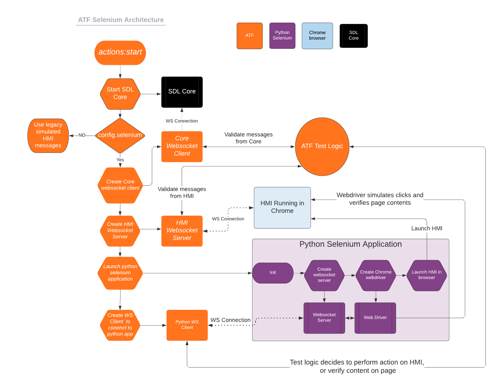

# ATF Selenium Support

* Proposal: [SDL-NNNN](NNNN-atf-selenium-support.md)
* Author: [Jack Byrne](https://github.com/JackLivio)
* Status: **Awaiting review**
* Impacted Platforms: [ATF / ATF Test Scripts / Generic HMI]

## Introduction

This proposal is to integrate the Generic HMI into ATF tests scripts by using selenium to control a web browser programatically.

## Motivation

Currently ATF is used to test SDL Core as a black box. ATF uses simulated mobile applications and a simulated HMI to test SDL Core functionality. While ATF is great testing SDL Core, the author aims to create a solution for having an automated test suite that tests both SDL Core and the Generic HMI together.

## Proposed solution

The solution is to create a python Selenium web driver that will control actions and validates the content of the HMI when it is interacting with SDL Core.

### Selenium Web Driver Application

#### Life Cycle 

ATF will launch the python app using the os.execute() method. The python application will then launch a physical instance of the Generic HMI in the chromium browser.

```
from selenium import webdriver
driver = webdriver.Chrome()
driver.get(GENERIC_HMI_LOCATION)
```

This application will stay running until the end of the test when ATF will shutdown the process. To close the browser the selenium driver calls:

```
driver.close()
```

#### Web Driver Actions

Selenium is capable of finding elements on a page and interacting with them.

```
driver.find_element_by_id(ELEMENT_ID).click()
```

This type of call will be used to press different buttons in the HMI. This will be useful for activating an app, opening the menu, pressing a softbutton etc. These actions will trigger the HMI's state to change and also trigger applicable RPC messages to be sent back to ATF for validation.

#### Web Driver Validation

The Selenium web driver can also be used to validate the content on the page. For example if a Show request is sent to the HMI, the webdriver should check that the text is correctly displayed.

```
return driver.find_element_by_id(ELEMENT_ID).text() == test.text
```

#### Communication with ATF

This python application will have a websocket server that will receive messages from ATF for specific test actions and content validation.

### Extra Websocket Server and Clients in ATF

#### Selenium Websocket Client

ATF will need to create a websocket client that relays messages to the python selenium application. These messages will tell the webdriver to click buttons and verify content displayed on the screen.

#### HMI Websocket Server

ATF will need to create a websocket server that will receive messages from the HMI. This server will then be routed through the ATF test logic to verify the contents of the HMI messages. After verifying that the messages are valid, ATF will pass the HMI message to SDL Core.

#### Core Websocket Client

ATF already has a websocket client that connects to SDL Core but this piece will need to be extended to allow for validation of messages before they are passed to the HMI.

### ATF Test Logic

When ATF is configured to use selenium, there are a few methods used in ATF that should be extended.

This is an existing simple test for a Show RPC request.

```lua
local function show(pParams)
  local cid = common.getMobileSession():SendRPC("Show", pParams.requestParams)
  pParams.responseUiParams.appID = common.getHMIAppId()
  common.getHMIConnection():ExpectRequest("UI.Show", pParams.responseUiParams)
  :Do(function(_, data)
      common.getHMIConnection():SendResponse(data.id, data.method, "SUCCESS", { })
    end)
  common.getMobileSession():ExpectResponse(cid, { success = true, resultCode = "SUCCESS" })
end
```

#### Extend ExpectRequest

In this code example there is a simulated mobile request being passed to SDL Core. The simulated HMI has a defined behavior for handling the request via ExpectRequest. For selenium compatible tests, ATF's ExpectRequest() should be extended to forward the RPC to the HMI and then the selenium web driver can verify the state of the HMI if applicable.

#### Extend SendResponse

After handling the request, the HMI will automatically respond with a success response. ATF will need to catch this response from the HMI and match it with the parameters included in the test. If the parameters match, ATF will forward the message to SDL core and the test will continue. To implement this behavior, the SendResponse() method will need to be extended for selenium compatible test scripts.

#### Extend SendNotification

Most notifications sent by the HMI are triggered as a result of a user interaction a with the HMI. Examples of these events are pressing a menu command, or consenting to app permissions.

```lua
local function onCommand()
  common.getHMIConnection():SendNotification("UI.OnCommand", { cmdID = 20, appID = common.getHMIAppId() })
  common.getMobileSession():ExpectNotification("OnCommand", { cmdID = 20, triggerSource= "MENU" })
end
```

SendNotification should be extended to notify the selenium web driver it should simulate a user action if applicable. In this case it would be selecting menu command with cmdID = 20. This will trigger the HMI to send the `UI.OnCommand` RPC. ATF will need to listen for this notification and match it with the parameters listed in the test. ATF will then forward the notification from the HMI to SDL Core after validating the msg contents.

#### Extend SendRequest

Similar to SendNotificaiton, ATF sometimes uses SendRequest to simulate an event that was triggered by a user action.

```lua
function m.app.activate(pAppId)
  if not pAppId then pAppId = 1 end
  local requestId = m.hmi.getConnection():SendRequest("SDL.ActivateApp", { appID = m.app.getHMIId(pAppId) })
  m.hmi.getConnection():ExpectResponse(requestId)
  m.mobile.getSession(pAppId):ExpectNotification("OnHMIStatus", { hmiLevel = "FULL", systemContext = "MAIN" })
  if m.mobile.getAppsCount() > 1 then m.run.wait(m.minTimeout) end
end
```

In this example the HMI is requesting to activate an application via `SDL.ActivateApp`. This action implies the user has selected the app from the app list, therefore the selenium application needs to simulate a user action. SendRequest would be extended to notify the selenium web driver to click an app on the app list to activate the app.

#### Extend ExpectResponse

Using the previous activate app example, the ExpectResponse method should be extended to be able to validate the state of the HMI changed post activating an app.

### RPC Switching

Because there is a mix of behavior for overwriting the previously mentioned methods in terms of requiring a simulated user action vs verifying the content displayed on the HMI, ATF should implement a structure that defines what actions the selenium web driver must take in the extended atf methods.

Schema for RPC Switching feature

The extended ExpectRequest method would reference this object to figure out what the selenium web driver actions are required. In this case the web driver would validate that the mainfield1 and mainfield2 text fields are displayed correctly

```json
{
  "UI.Show" : {
    "ExpectRequest": {
      "validate": [{
        "id": "#mainfield1", //user by Document.getElementById()
        "text": <Show text 1> // text to validate the contents of the field
      }, {
        "id": "#mainfield2", //user by Document.getElementById()
        "text": <Show text 2> // text to validate the contents of the field
      }] 
    }
  }
}
```

This example shows how an extended SendNotification for an onCommand would instead trigger a button press on the HMI causing the OnCommand to be sent.

```json
{
  "UI.OnCommand" : {
    "SendNotification": {
      "action": [{
        "id": "#cmdID20", //user by Document.getElementById()
        "function": "click" // action to be taken by the webdriver
      }] 
    }
  }
}
```

This example shows how a SendRequests behavior would be overwritten for activating an app (which involves a user selecting the app from the app list)

```json
{
  "SDL.ActivateApp" : {
    "SendRequest": {
      "action": [{
        "id": "#appListItem1", //user by Document.getElementById()
        "function": "click" // action to be taken by the webdriver
      }] 
    }
  }
}
```


This example shows how an ExpectResponse behavior would be overwritten for the activate app response. After the response is received the web driver will validate the app is active via the displayed app name

```json
{
  "SDL.ActivateApp" : {
    "ExpectResponse": {
      "validate": [{
        "id": "#appListHeader", //user by Document.getElementById()
        "function": <App Name> // text to validate the contents of the field
      }] 
    }
  }
}
```

### Scope Of Test Scripts

ATF has a very large collection of tests that are implemented with varying design patterns. It is hard to gauge the scope of how much work it would take to make every atf compatible with the selenium web driver. The author suggests that the initial implementation of this proposal covers basic smoke test cases such as registering an app, activating an app, displaying some data, and performing some sort of button press type interactions.

### Architecture Diagram



## Potential downsides

This proposal includes a lot of components that have to interact and communicate with one another. Maintaining and developing this proposal would take a lot of work but the author thinks it would be extremely beneficial in helping automate our IVI related components tests. The less time we spend manually testing features, the more time we have for bug fixes and feature development.

## Impact on existing code

### ATF

- ATf will need to implement some new websocket servers/clients to communicate with the different componets seen in the architechture diagram.
- ATF request/response methods should be extended to handle the RPC switching feature for this proposal
- ATF will need to handle the lifecycle of starting and stopping the python selenium application.

### ATF Test scripts
- Some scripts may need to be modified more than others to accomodate the selenium testing feature.

### Python Selenium Application
- Websockets should be setup to communicate with the atf test scripts. The web driver will read messages that contain the actions defined in the RPC switching section.

### Generic HMI
- Generic HMI might need to be updated to include the id property for applicable html elements to allow for the selenium web driver to easily find these elements that need validation or interaction


## Alternatives considered

An alternative solution would be to first create automated selenium tests that only interact with the generic hmi. This simplified solution wouldn't involve SDL Core or ATF.
