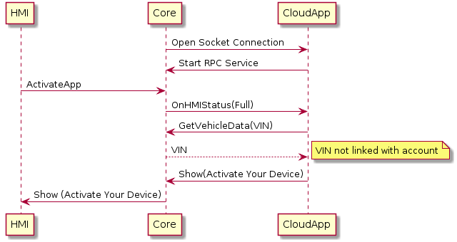
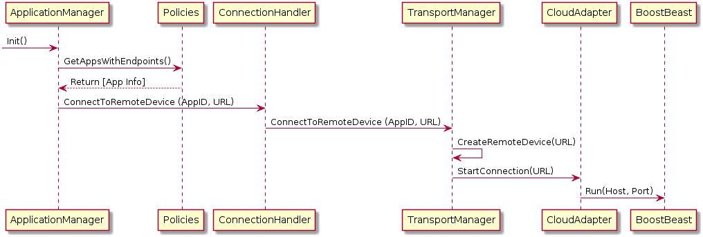
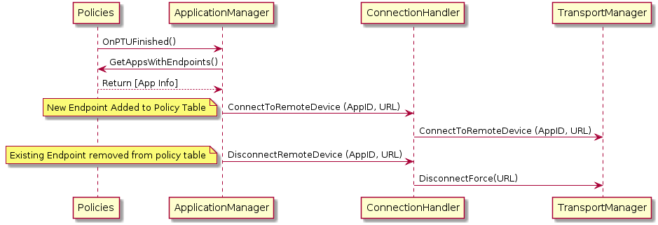

# Cloud App Transport Adapter

* Proposal: [SDL-NNNN](NNNN-cloud-app-transport-adapter.md)
* Author: [Jack Byrne](https://github.com/smartdevicelink)
* Status: **Awaiting review**
* Impacted Platforms: [Core]

## Introduction

This proposal will detail a possible solution for allowing  SDL-enabled cloud applications to be used in a vehicle. This proposal will cover the process of obtaining web application server endpoints, opening connections between Core and a cloud based app server, and how a web application can authenticate connected head units. 

The implementation of a SDL web app javascript library used to create SDL connected web applications will be covered by another proposal. 


## Motivation

### Background on SDL-enabled Web Applications:
- SDL web apps would still use the SDL RPC Service / protocol
- SDL web apps would integrate a proxy library that supports all Mobile API RPCs (implemented in Javascript)
- SDL web apps live in the "cloud", not in the car or phone
- Using a web app on the head unit would not require mobile a mobile device, but does require head unit to have an active data connection
- SDL Core initiates the connection to cloud application using endpoints supplied by policy table updates (OEMs control trusted app connections)

Implementing this feature means that the user would not be required to connect their personal device in order to use SDL connected applications. Also, offering a new way to build and connect SDL apps might attract new developers.

## Proposed solution

### High level overview of connection process and authentication

1. Core performs a policy table update to retrieve web application server endpoints. (Optional)
2. Core opens a websocket connection for each web app endpoint located in the policy table. 
3. The web app starts an RPC service and registers an app on the head unit
4. The user puts the app in full and the web app must perform a getVehicleData request for the VIN. 
5. If the web app recognizes the VIN it continues with its normal app behavior.
6. If the web app does not recognize the VIN, the web app must send a show with the following message:
```
Activate Your Device
Code: 12345
Visit www.appwebsite.com/activate
```
7. The user must go to the applications website and register their connection before the web app can be used.

This method of authentication uses a similar flow for activating streaming services (ie Roku/Apple TV -> Netflix)



### Obtaining Web App IP Address and Port
Maintaining a list of urls for each web app will be similar to how policies for SDL applications are currently managed. There will need to be two new fields introduced in the app_policies section of the policy table. 

This is what the app_policies section of a policy table that includes a web app endpoint might look like: 

```JSON
        "app_policies": {
            "default": {
                "keep_context": false,
                "steal_focus": false,
                "priority": "NONE",
                "default_hmi": "NONE",
                "groups": ["Base-4"]
            },
            "IOSApp12345": {
                "keep_context": true,
                "steal_focus": true,
                "priority": "NONE",
                "default_hmi": "NONE",
                "groups": ["Base-4", "Location-1", "Emergency-1"]
            },
            "WebAppID12345" : {
                "keep_context": true,
                "steal_focus": true,
                "priority": "NONE",
                "default_hmi": "NONE",
                "groups": ["Base-4"],
+                "endpoint": "https://10.0.0.1:8080",
+                "certificate" : "-----BEGIN CERTIFICATE-----\n" ...
            }
        }
```

The endpoint field includes the URL/IP and port that the SDL web app can be connected to. The certificate field is used for secured RPC service connections which equates to opening a secured websocket connection. The TLS "certificate" field could be optional to allow for unsecured RPC service connections.

Endpoints can be added, removed, or updated via policy table updates. This means OEMs will be in control of the web apps that their head units attempt to connect to. 

#### Transport Adapter Connection Flows

- Ignition On: Core will read from the policy table for known connection endpoints. This information will be forwarded to the transport adapter level for client websocket connections to be opened.



- Policy Table Update: After receiving a policy table updated and endpoint data has been updated, Core will open new connections for newly added endpoints and close connections for endpoints that have been "revoked"

Add use case for if app changes.



- User Refreshes Connections: This case would be useful if a cloud app is unregistered due to a connection error. Depending on the build of the transport adapter, this trigger could be activated periodically or manually from user input.


## Potential downsides

The suggested authentication method does enforce that app developers will properly handle authentication. Also this method would require extra integration steps on the app developers side. 

It might be easy to fake the VIN and impersonate another user. A different form of identification could be used if this is a major concern. 

OEM must maintain extra set of policy related data (Endpoints and certificates). If an endpoint becomes outdated, head units will try to connect to an unknown endpoint. 

Adding a new Javascript proxy library means another major repository must be developed and maintained. This effort requires new feature development, issue tracking/bug fixes, creating documentation.

## Impact on existing code

### SDL Core

#### New Device Type

A new enum must be added to DeviceType to differentiate cloud app connections from app connections located in the vehicle. 

```c++
enum DeviceType {
  CLOUD,
  AOA,
  PASA_AOA,
  BLUETOOTH,
  PASA_BLUETOOTH,
  MME,
  IOS_BT,
  IOS_USB,
  TCP,
  UNKNOWN
};
```

#### Websocket Client Transport Adapter
Core will need a new transport adapter that initiates websocket client connections to a remote endpoint. I suggest creating a transport adapter that integrates this library: [Boost Beast](https://github.com/boostorg/beast) for handling the websocket connections.  

### Policies

app_policies section of policy table related classes must be expanded to support new optional endpoint and ssl_certificate fields. 

types.h
```
struct PolicyBase : CompositeType {
 public:
  Strings groups;
  Optional<Strings> preconsented_groups;
  Enum<Priority> priority;
  Enum<HmiLevel> default_hmi;
  Boolean keep_context;
  Boolean steal_focus;
  Optional<String<0, 255> > cloud_app_endpoint;
  Optional<String<0, 65535> > ssl_certificate;
```

policy_table_interface_ext.xml
```
    <struct name="ApplicationParams">
        <param name="groups" type="Strings" />
        <param name="nicknames" type="Strings" mandatory="false" />
        <param name="preconsented_groups" type="Strings" mandatory="false" />
        <param name="AppHMIType" type="AppHMITypes" mandatory="false" />
        <param name="priority" type="Priority" />
        <param name="default_hmi" type="HmiLevel" />
        <param name="keep_context" type="Boolean" />
        <param name="steal_focus" type="Boolean" />
        <param name="memory_kb" type="Integer" minvalue="1" maxvalue="65225" mandatory="false"/>
        <param name="watchdog_timer_ms" type="Integer" minvalue="1"
            maxvalue="65225" mandatory="false"/>
        <param name="cloud_app_endpoint", type="String", minlength="0" maxlength="255", mandatory="false">
        <param name="certificate" type="String" minlength="0" maxlength="255"
            mandatory="false" />
    </struct>
```
This feature should be supported by both regular and external policy build configurations.

### SDL Server

SDL Server must create an interface for managing additional policy data. Interface should allow for adding, updating, and revoking endpoint urls and SSL certificates. This work should be minimal since its only two extra parameters.

## Alternatives considered

Since there are many aspects to this proposal, I have considered a few alternatives.

### Using Tokens to authenticate

1. Core gets web app endpoints and associated tokens from policy server after a policy table update. 
2. Core opens a websocket connection for each webapp endpoint located in the policy table. 
3. Core sends the VIN and token to the application and waits for the application to respond with data.
4. The web application server sends a request to the policy server to identify the incoming connection via the received VIN and token. 
5. If the policy server responds matches that the VIN and token are valid it responds with success to the web app server. 
6. The web app server starts an RPC service with Core.

```JSON
        "app_policies": {
            "default": {
                "keep_context": false,
                "steal_focus": false,
                "priority": "NONE",
                "default_hmi": "NONE",
                "groups": ["Base-4"]
            },
            "IOSApp12345": {
                "keep_context": true,
                "steal_focus": true,
                "priority": "NONE",
                "default_hmi": "NONE",
                "groups": ["Base-4", "Location-1", "Emergency-1"]
            },
            "WebAppID12345" : {
                "keep_context": true,
                "steal_focus": true,
                "priority": "NONE",
                "default_hmi": "NONE",
                "groups": ["Base-4"],
+                "endpoint": "https://10.0.0.1:8080",
+                "certificate" : "-----BEGIN CERTIFICATE-----\n" ...,
+                "token": "1234"               
            }
        }
```

Using a token to authenticate means that no RPC service would be opened with unknown users.

### Using the Mobile Device to Connect

If future vehicles will not have dedicated LTE connections, then the mobile device could be used as the proxy for connecting web apps to core. The phone would connect to core using traditional SDL transports, and then also maintain a socket connection with the cloud application. Any data sent from Core/Cloud App would be passed through the phone. 

### Separating Policies and Cloud App Endpoints

A seperate server could be developed to maintain cloud app endpoints if we believe that this type of logic and data is outside of the scope of policies.

### Alternative to using the VIN

If we decide that the VIN should be protected and not used to authenticate users, we could create a hash of the VIN and salt the hash with the system time as a string.

For Example
Vin: 3C6UD5CL2CG214164
System Time: Fri Mar  9 15:55:09 EST 2018
System Time as YYYYMMDDHHMMSS: 20180309155555
 
String to hash (Time + VIN): 201803091555553C6UD5CL2CG214164
Sha1 Hash: 05ee749233263a138d4d2ddb4495508866c3f981

Before opening the connection with the cloud app, Core will write the hash to disk to use for all future connections with that endpoint.
