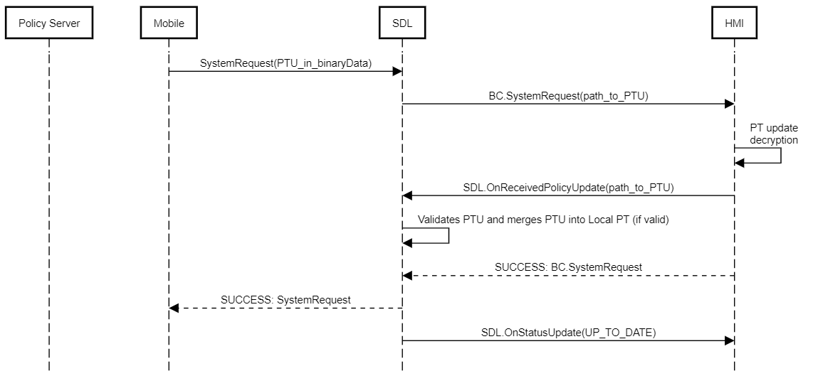
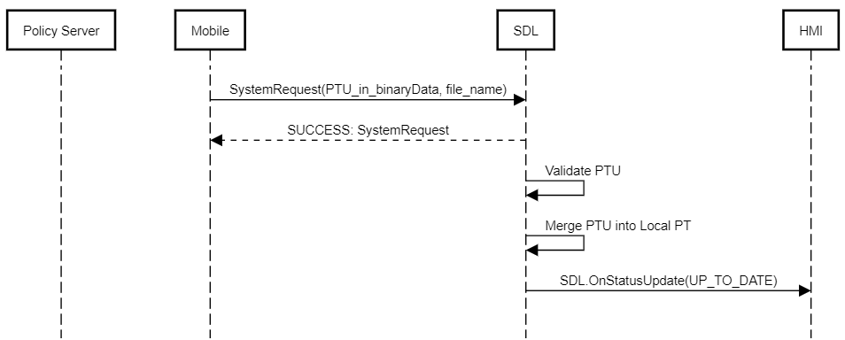

# Reject PROPRIETARY/HTTP SystemRequests when PTU is not in progress

* Proposal: [SDL-NNNN](nnnn-reject-proprietary-http-systemrequests-when-ptu-not-in-progress.md)
* Author: [ShobhitAd](https://github.com/ShobhitAd)
* Status: **Awaiting review**
* Impacted Platforms: [Core]

## Introduction

This proposal is to make modifications in sdl_core to reject incoming `PROPRIETARY`/`HTTP` SystemRequests if there is no policy table update (PTU) in progress.

## Motivation

As reported in the sdl_core issue [#3076](https://github.com/smartdevicelink/sdl_core/issues/3076), it is currently possible to update the policy table when a PTU procedure is not in progress using a SystemRequest.

### **SystemRequest(PROPRIETARY)**

If an application sends a SystemRequest with requestType `PROPRIETARY`, nonempty fileName and PTU contents in the bulkData, SDL will forward the request to the HMI. The HMI then sends an `OnReceivedPolicyUpdate` notification to SDL which applies the policy table from the file.



### **SystemRequest(HTTP)**

If an application sends a SystemRequest request with requestType `HTTP` and PTU contents in the bulkData, SDL will attempt to validate and apply the policy table from the file.



This is a security concern because, if an OEM isn't using PTU encryption, any app could try to update the PT to get all permissions at any time.

## Proposed solution

The proposed solution is to add a check in the `system_request.cc` to check if:

1. The requestType is `PROPRIETARY` or `HTTP`
2. There is a PTU procedure in progress
3. The app that was sent the `OnSystemRequest` notification with the policy table snapshot is the one sending the `SystemRequest`.

If Condition **1.** is met but **2.** and/or **3.** are not, the `SystemRequest` should be rejected.

### Adding check for PTU in progress

Adding this check would require being able to access information about the Policy Table update status. One potential implementation would be to add a method `bool IsPTUSystemRequestAllowed(const uint32_t app_id)` in the `PolicyHandler` class and use the policy_manager method `PolicyManagerImpl::GetPolicyTableStatus()` method to check the PTU status

- Implement method in `policy_handler.cc`

```c++
bool PolicyHandler::IsPTUSystemRequestAllowed(const uint32_t app_id) {
  SDL_LOG_AUTO_TRACE();
  const auto policy_manager = LoadPolicyManager();
  POLICY_LIB_CHECK_OR_RETURN(policy_manager, false);
  ...
  bool is_ptu_in_progress = policy_manager->GetPolicyTableStatus() == 
  "UPDATING";
  ...
  return is_ptu_in_progress;
}
```

- Add check in `system_request.cc`

```c++
  SDL_LOG_DEBUG("Binary data ok.");

+  if (mobile_apis::RequestType::PROPRIETARY == request_type ||
+    mobile_apis::RequestType::HTTP == request_type) {
+      auto app_id = application->app_id();
+      if(!policy_handler_.IsPTUSystemRequestAllowed(app_id)) {
+        SDL_LOG_DEBUG("Rejected PTU SystemRequest from app " << app_id);
+        SendResponse(false, mobile_apis::Result::REJECTED);
+        return;
+      }
+  }

  if (mobile_apis::RequestType::ICON_URL == request_type) {
    application_manager_.SetIconFileFromSystemRequest(file_name);
```

## Potential downsides

The proposed solution does not completely fix the issue. Since the app used to carry out the PTU is selected randomly (using `PolicyHandler::ChooseRandomAppForPolicyUpdate`), the PTU OnSystemRequest can be received by a bad actor. This will allow the bad actor to send `PROPRIETARY`/`HTTP` SystemRequests during the PTU procedure to modify SDL's local policy table. Limiting this behavior might also have unintended consequences to other OEM's policy flow.

## Impact on existing code

The proposed solution would only make changes to the `PolicyHandler` class and `system_request.cc`. No modifications would be required to the MOBILE and HMI API.
This proposal will not impact the HMI PTU feature.

## Alternatives considered

An alternative to the proposed solution would be to force all PTUs to be encrypted. This would allow SDL to verify that the PTU is received from the policy_server.