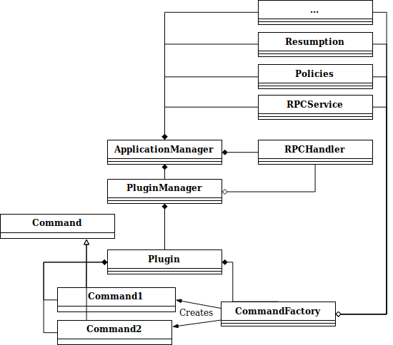

# RPC design refactoring

* Proposal: [SDL-NNNN](nnnn-rpc-design-refactoring.md)
* Author: [Alexander Kutsan](https://github.com/LuxoftAKutsan)
* Status: **Awaiting review**
* Impacted Platforms: [Core]

## Introduction

This proposal is to rework the design of the SDL core application manager layer in order to:
 - Reduce coupling between components
 - Reduce responsibility of the ApplicationManager class
 - Provide plugin architecture for easy adding additional functionality and RPC groups   

## Motivation

The SDL core project is actively implementing new features and new functionality.  
To keep the project on track and to reduce risks of regression during implementation
refactoring of application manager layer is necessary.  

Currently, extending SDL functionality may require code duplication. 
The current RC module duplicates logic of the application_manager layer -- there is separate request controller, separate mechanism to call policy checks, and RPC's processing. Currently any common logic that is implemented in the application_manager layer needs to be duplicated in request controller -- this results in bugs and redundant code; it also requires more time for implementation.

The following proposed solution will provide for better management and extensibility of SDL core RC components, without duplicating SDL core code:

## Proposed solution
#### Reduce coupling between components and use a dependency injection practice

During component construction all dependencies should be explicitly received.
This practice will improve encapsulation for the project and make code much more maintainable going forward.


#### Reduce responsibility of the ApplicationManager class 
Currently the application manager class has too many responsibilities:
 - Service location
 - Mobile/HMI RPC processing 
 - Mobile/HMI RPC sending 
 - Registration and managing mobile applications
 - Handle different states of SDL (low voltage/ video streaming / audio_path_throw ...) 
 
The purpose of this refactoring is to extract handling & sending RPC's to a separate module.
 For example, many SDL commands require the application manager only for sending RPC's; these commands do not need to know information related to other application manager responsibilities.
 Also, extracting RPC processing to separate modules will reduce regression risks related to changing functionalities in the ApplicationManager.
 
#### Provide plugin architecture for adding additional functionality and RPC groups easily.

SDL RPC's can be split into groups of RPC's related to certain functionality (for example RC or video streaming).  
These RPC's may work with functionality that is not required by other RPC's, so exposure should be limited to the RPC's group.

Adding new RPC or groups of RPC's is currently a very complicated and unclear process.

The best solution is to adopt a plugin approach of adding new RPC's to SDL core.
This will allow OEM's to implement code for new RPC's with ease by implement certain interfaces and provide them to SDL as shared library.


## Detailed design

### Use dependency injection for commands 

Commands should be accepted as a list of services that they require. The mobile factory should be responsible for providing this list of dependencies.  

#### Current Approach 
```cpp

SomeCommand::SomeCommand(app_mngr);

void SomeCommand::Run() {
  application_manager->protocol_handler().do_staff();
  application_manager->state_controller().do_staff();
  application_manager->PolicyHandler().do_staff();
  application_manager->resume_controller().do_staff();
  
}
```

#### New Approach 
```cpp

SomeCommand::SomeCommand(protocol_handler, state_controller, policy_handler, resume_controller);

void SomeCommand::Run() {
  protocol_handler_.do_staff();
  state_controller_.do_staff();
  protocol_handler_.do_staff();
  protocol_handler_.do_staff();
}
```
This will simplify code and provide the possibility to add a new component to certain commands without affecting other commands.
The factory will create the command with all required parameters, so existing code will not be complicated.
RC component contains class ResourceAllocationManager. And non-RC commands should have no access to this class, so it should be passed only to RC commands. 

### Reduce responsibility of ApplicationManager class 

Logic of handling and sending RPC's should be extracted from ApplicationManager to separate components `RPCHandler`, `RPCService`.

### RPCHandler
RPCHandler class should implement interfaces ```HMIMessageObserver```, ```ProtocolObserver```, handle incoming RPC's from HMI or mobile 
and process them. 

RPCHandler responsibilities:
 - Handle HMI/Mobile RPC's in message loop
 - Class checking policies on each RPC
 - Creating command from message with Command Factories
 - Send command for execution to Request Controller
 
 ### RPCService

RPCService should provide interface for sending messages to Mobile/HMI.  
RPCService should be passed to commands for Sending RPC's using dependency injection approach.

RPCService responsibilities:
 - SendMessage to HMI/Mobile
 - Call checking policies if message is allowed to send
 - Provide Request Controller information of any incoming request should be terminated.  

### Provide plugin architecture for easy adding extra functionality and RPC groups   

Create **PluginManager** class that will be responsible for searching and loading rpc plugins.
All commands logic should be stored in rpc plugins. 

Each RPC plugin should implement following interfaces:
 - Command Interface :
 - CommandFactory Interface : 

#### Plugins responsibilities:
 - Provide list of supported commands
 - Create commands from smart object
 - Contain command logic

SDL will provide to *Plugin* interfaces of all services on application manager layer:
 - RPCService
 - PolicyHander
 - StateController
 - ApplicationManager
 - RequestController
 - ResumeController
 - etc ...

RPC Handler will use PluginManager to get plugins that is able to process required RPC. 
RPC Handler will use Command Factory from plugin to create Command for further processing.



## Potential downsides
This change requires major changes of application manager layer. 
## Impact on existing code
This proposals requires a major version change for SDL core.
## Alternatives considered
The only alternatives is to following existing approach, duplicating the logic of application_manager layer -- this approach is becoming unsustainable and should be avoided.
